# Substance 3D Painter

Adobe Substance 3D Painter is a piece of 3D software that we can use to paint textures onto 3D models. For a complete beginners overview on how to use Substance Painter, you can check out this video by [Flipped Normals](https://www.youtube.com/watch?v=RQ-hRk0WHJ8&t=307s)

## Exporting our Model

In order to load our model into Painter, we need to first export our model from Maya as an FBX file. An FBX file is a model format developed by Autodesk that can hold a variety of information about our 3D object including material and animation data.

**The export our model as an FBX:**

1. Select all parts of the model you want to export in object mode.
2. Navigate to File > Export Selection (I typically save my model for texturing in my Source Images folder in my Maya project)
3. Change the file type to FBX
   
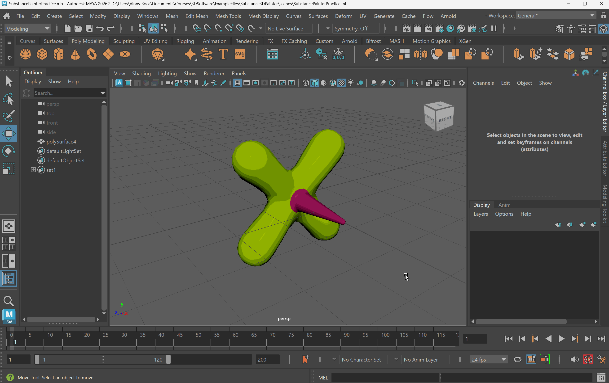

## Creating a New File in Substance Painter

**To create a new file in substance painter:**

1. Navigate to File > New
2. For Template, choose ASM-PBR Metallic Roughness.
3. For file, press Select… and choose your FBX file.
4. For Document Resolution you can choose 2048 or 4096 (this is how large your texture files will be).

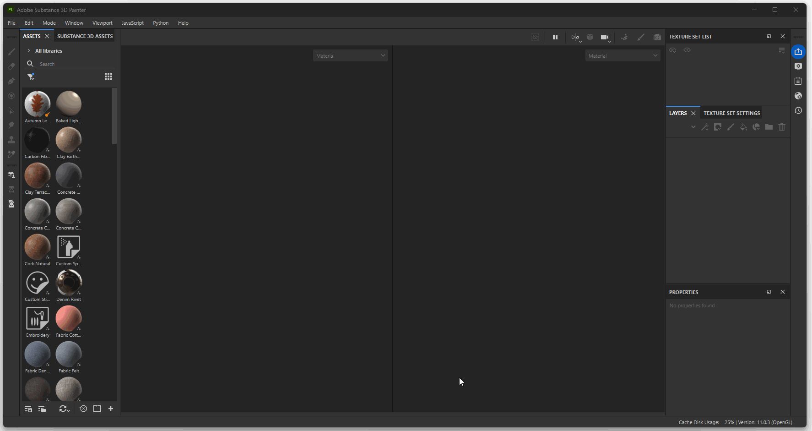

## UI Navigation

The UI of Substance Painter is separated into 4 parts.

1. Assets - this is where we choose materials and brushes.
2. 3D viewport - this is where we can view our model in 3D and edit our textures
2. 2D viewport - this is where we can view our UVs and edit our textures
3. Texture Set List and Layers - this where we can change the material we are working on as well as edit our material properties.

## Navigating the 3D Viewport

Navigation within the 3D Viewport within Substance Painter is controlled by the same hotkeys we use in Maya:

- Zoom: Alt+Right Mouse Button 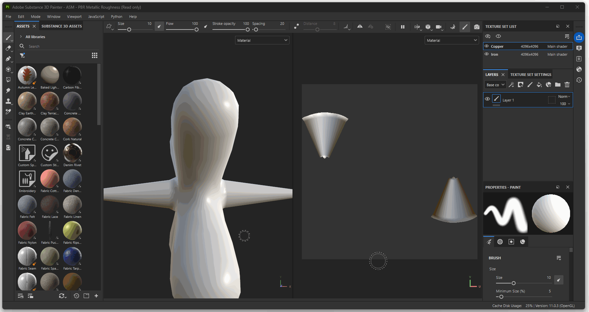
- Pan: Alt+Middle Mouse Button 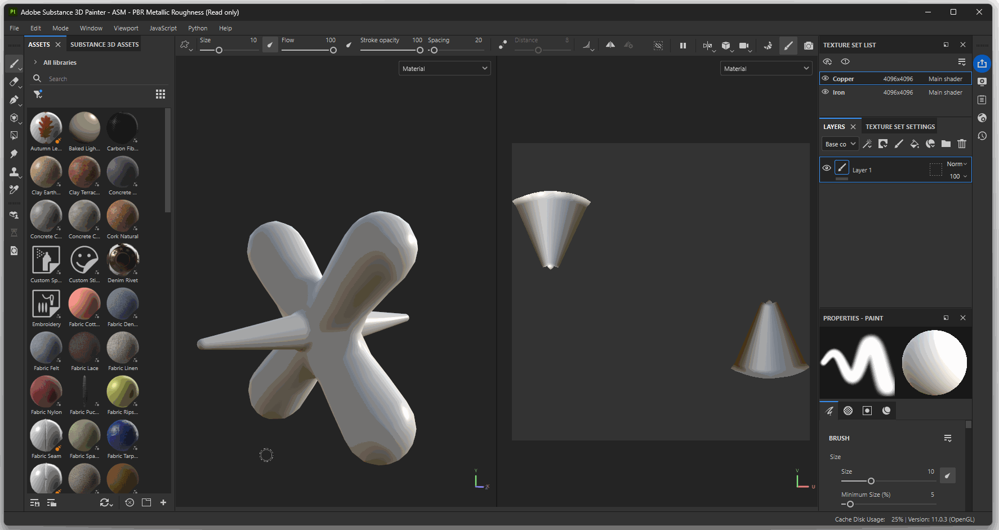
- Rotate: Alt+Left Mouse Button 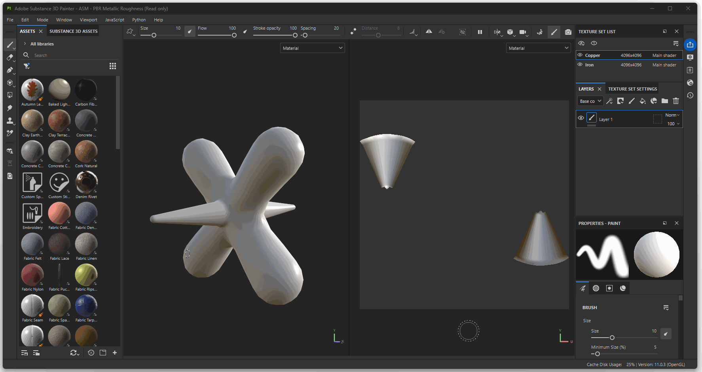
- Change Rotation of Lighting: Shift+Right Mouse Button

## Baking Mesh Maps

Substance Painter has many interesting features, such as checking for indented spots in or model, or adding textures based on the direction that components are facing. Many of these features, however, only work if we bake mesh maps.

Mesh maps are extra information about our model that Substance Painter uses to create procedural textures such as dirt in crevices.

It is important when using Substance Painter to bake your mesh maps before you begin working on your textures. 

**To Bake Mesh Maps:**

1. Navigate to your Texture Set List
2. Next to the Layer tab, click on the Texture Set Settings tab.
3. Scroll down and select Bake Mesh Maps under the Mesh Maps section
4. When the bake window opens, change your Output Size to match your document size (2048, 4906, etc.)
5. Press Bake selected textures.
6. When the process completes, press Return to painting mode

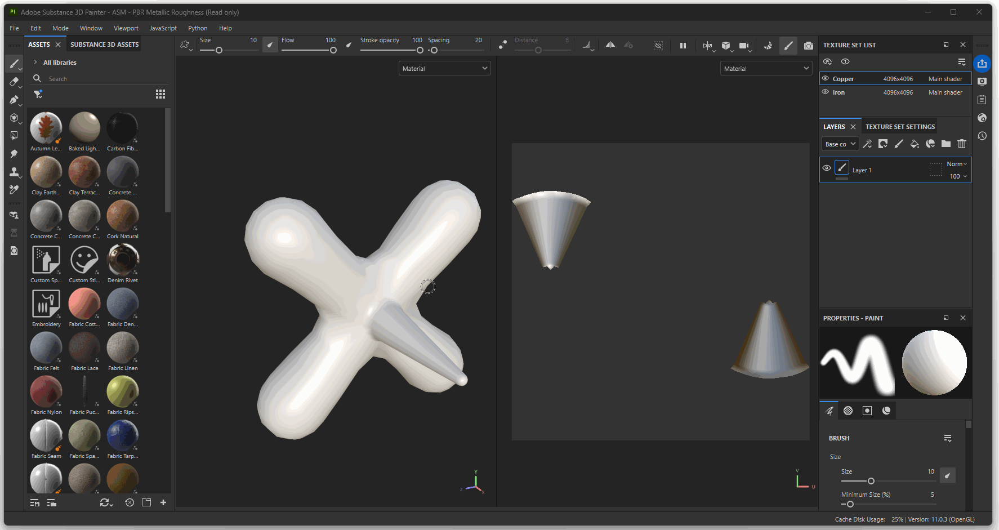

## Texture Sets

Within Substance Painter, I can change which material I am effecting by selecting different texture sets.

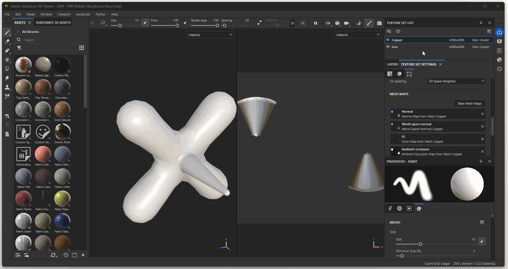

## Changing Environment Lighting

By default, Substance uses and HDRI, a high definition render image, to create the background. This image is called "Panorama" and is an image of an outdoor environment.

This image is no ideal for creating textures because the light it provides our model contains a variety of colors.

When texturing painting in Substance Painter, it is best to use a neutral gray lighting environment.

**To change the lighting environment:**

1. Navigate to Display Settings on the right side of the UI
2. Select the Environment map setting
3. Change the map to "Studio White Umbrella" or similar.

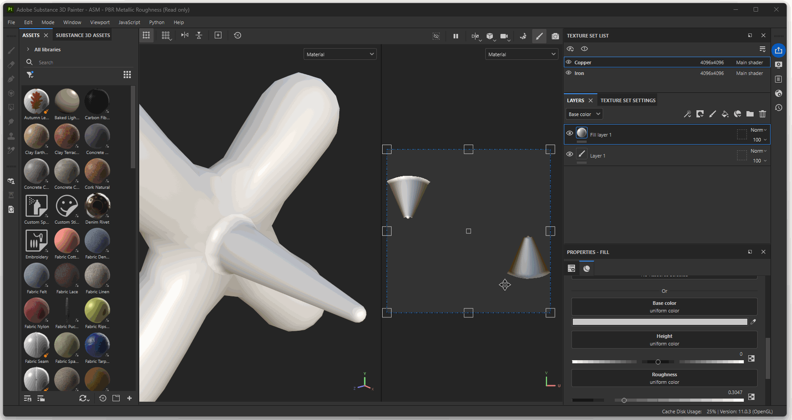

## Layers

Similar to Photoshop, in Substance Painter, we use layers to create complex materials.

Since we are using layers, it is typically best in Substance Painter to work with a combination of Fill Layers and Masks to create intended results.

### Fill Layer

**To create a fill layer:**

1. Navigate to your Layers tab.
2. Press the Fill Layer button (paint can)

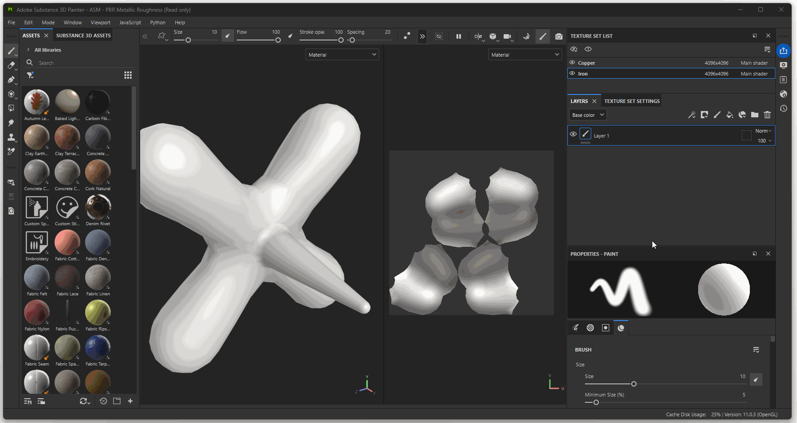

### Material Properties of Fill Layer

Within the properties panel of our Fill, in the section labeled filled, we can notice five different options for adjusting the properties of our material. You can activate different properties by pressing their buttons.

Thinking back to when we created our Substance Painter file, we chose the template “ASM-PBR Metallic Roughness”. What does this actually mean? We can ignore ASM, this stands for Adobe Standard Material (Adobe is the company that makes Substance Painter).

What is important here is to understand the terms PBR, Metallic and Roughness. For much of the history of 3D graphics, there were a variety of different ways in which you could create materials. You might adjust how specular a material is or how glossy it appears. Every company, product and researcher had a different way of making a material in 3D mimic real world material properties.

While hopes for creating a standardized way of creating materials was around from the beginning of computer graphic materials in the 1960s, it wasn’t until the mid-2010’s that displaying and creating materials became more standardized across a variety of software.

This standardization is called PBR, or Physically Based Rendering.

The goal of Physically Based Rendering is to use the properties of real world materials, such as how rough an object is or how metallic an object is, to describe its properties within the world of 3D. In essence, all these material properties describe how light interacts with materials. A rough object will absorb more light than a gloss object. A metallic object will stop light from being absorbed and will bounce it back directly, creating a reflective surface. All of these properties deal with how light is either reflected or absorbed on different materials.

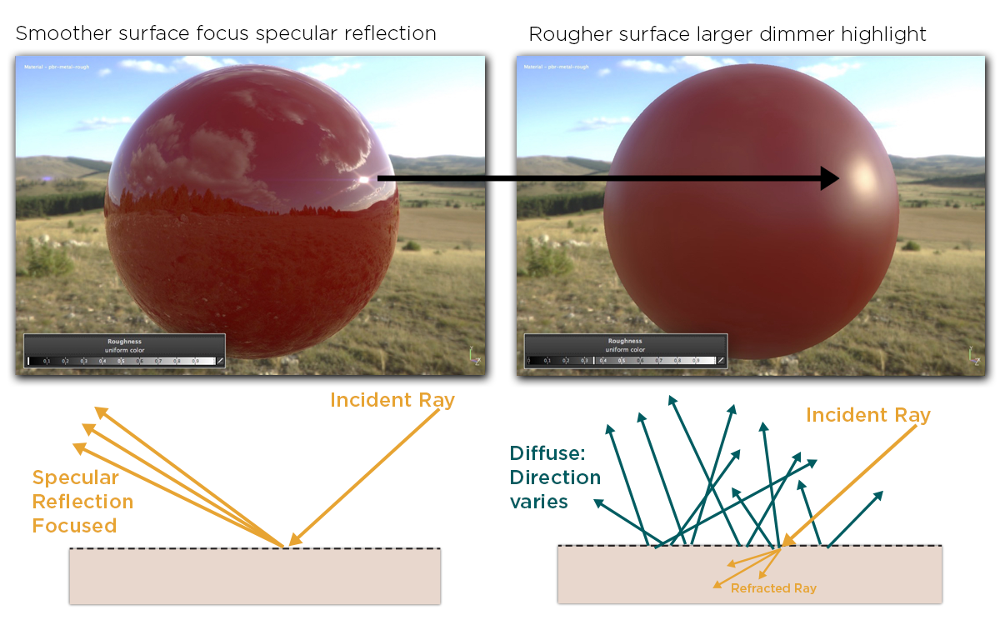

Adobe has some great [resources](https://www.adobe.com/learn/substance-3d-designer/web/the-pbr-guide-part-1?learnIn=1&locale=en) with more information about PBR. Most of this material is pulled from work done by Allegorithmic, the original designers of Substance Painter.

For more detailed video explanation on PBR rendering, check out this video by [Flipped Normals](https://www.youtube.com/watch?v=a4dURVZEi3E&t=87s).

So what are the properties we are dealing with in Substance Painter?

### Color

This will change the base color of our model. This changes what color our material reflects back into the world.

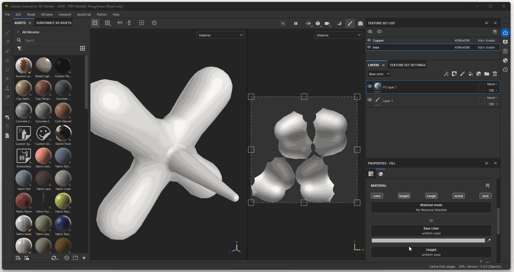

### Height

This will control how much height can be added to our model. This property will not be relevant at the moment with our current project.

### Roughness

This will change how rough our material is. A value of 1 or white is perfectly rough while a value of 0 or black is perfectly smooth and reflective. This property changes how much light our material reflects versus absorbs.

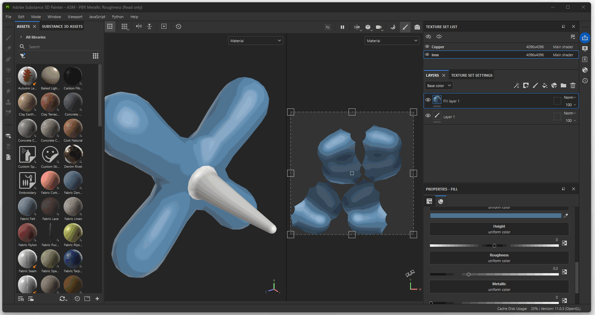

### Metallic

This will change how metallic our object is. A value of 1 or white is a perfectly metallic material while a value of 0 or black, is a non-metallic material.

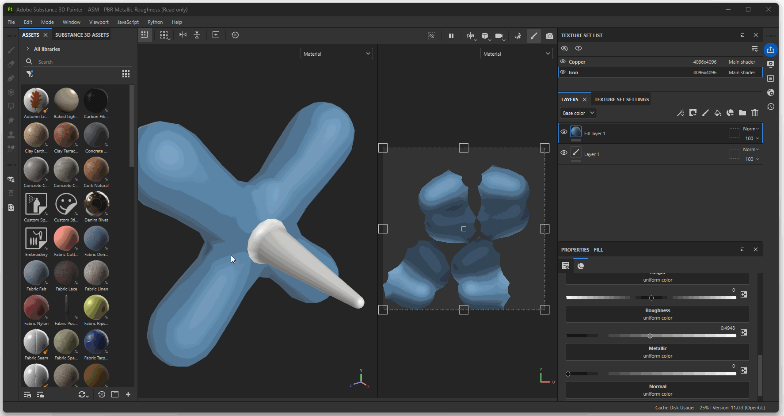

### Normal

Normal is a slightly more complicated material property. Unlike the properties above, the Normal material property allows us as artists to change the surface appearance of the geometry of our model.

Normals and normal maps are essentially an optical illusion. They allow us to take an image texture and apply it to our model to create the appearance of a more complex surface.

Taking a look at the [website](https://cpetry.github.io/NormalMap-Online/), we can get a better sense of how this process works.

Within the website we can see this strange image in the center. Oftentimes normal maps will have this purple-ish appearance. This is not an image that we might think of as a photograph, instead this is a utility image, often called utility maps. Utility maps don’t store image data in the conventional sense, instead they store data that can be interpreted by a piece of software to create a variety of effects.

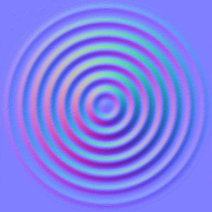

The reason normal maps have these strange colors is because they use the property of images containing RGB (or Red, Green, and Blue) data, to store XYZ data. In a normal map, the color Red is equal to the X direction, Green equals Y direction, and Blue equals Z direction.

The normal map, as a utility map containing XYZ data, gives information to our material on how to create the surface of our object. In other words, when light hits the surface our our material, our normal map is consulted to see which direction the light should bounce back, or if that part of our material is in shadow.

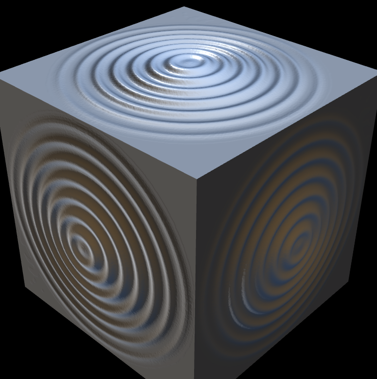

In essence, the normal map is a powerful “hack” within computer graphics which allows us to create more complex geometry by storing surface details within an image texture. A normal map, however, can really only be used for fine details. We can notice on the cube that although the surface appears to have these concentric circles, when we look at a face of the cube from the side, the actual geometry of our surface is not deformed at all. 

**As an example within in Substance Painter:**

1. Navigate to Textures within the Asset browser.
2. Click and drag the texture named “flakes” into the normal slot of your Fill layer
We can notice that we are only dragging a texture onto our model, however this texture creates the appearance of new details on the surface of our model.

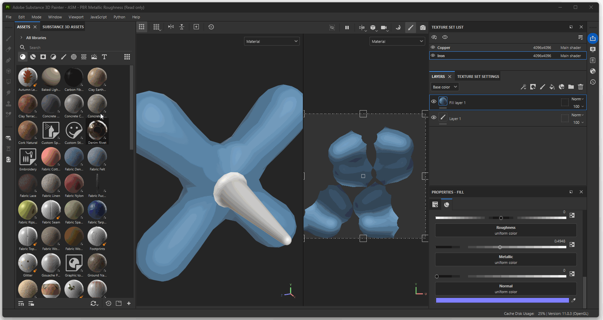

### Image Textures

This process of images storing data is also true from our Roughness and Metallic channels. Instead of data being stored in RGB, for Roughness and Metallic, image data is stored in black and white values.

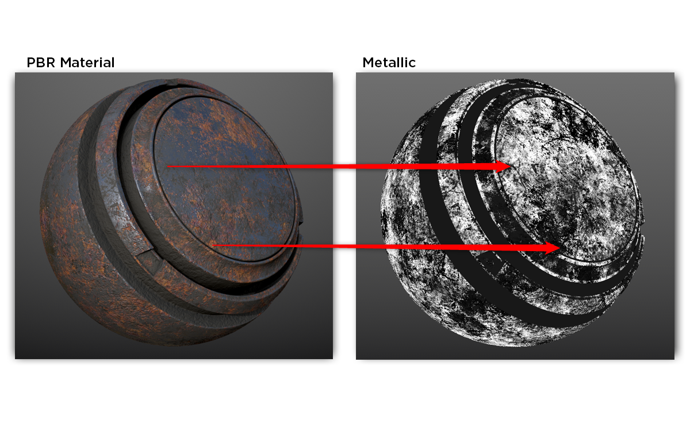

**As an example:**

1. Navigate to Textures within the Asset browser.
2. Click and drag the texture named “Grunge Plaster Faded” into the roughness slot of your Fill layer

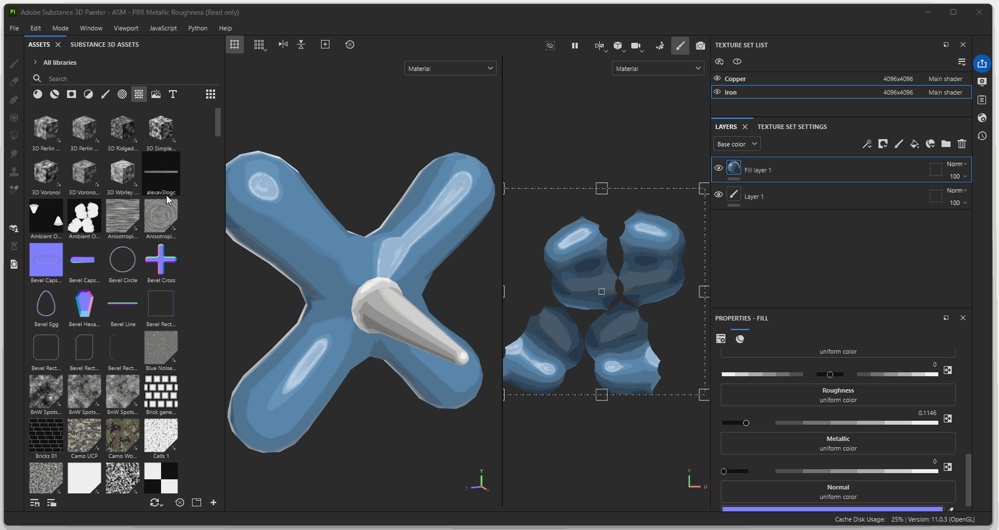

We can notice that different parts of our material are rough or reflective based on the black and white values with our texture map.

## Masks

To create complex material in substance painter, it is best to use a variety of layers with black or white masks.

**To add a Black mask to your layer:**

1. Click on the a layer you want to add a mask to
2. Press the mask button and select “add black mask”

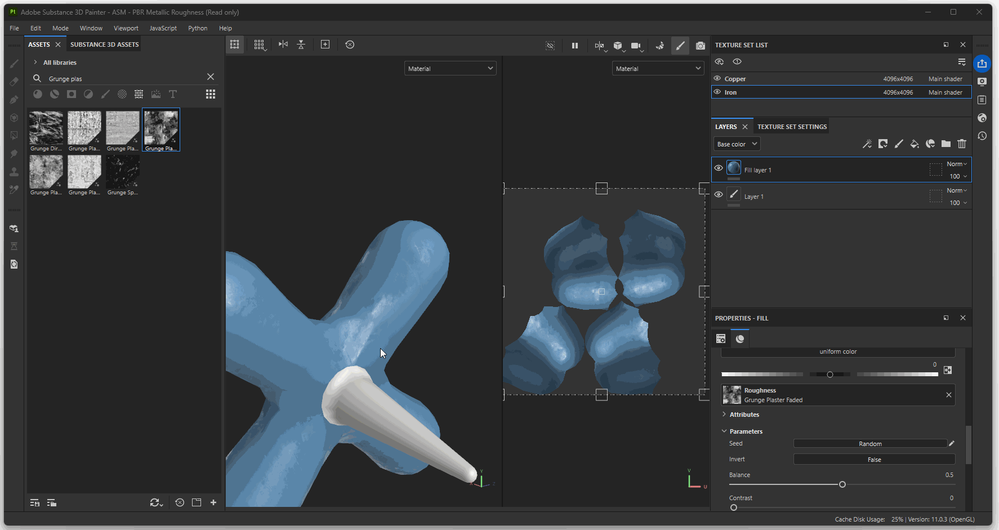

A mask is a technique in layer based software to hide or reveal different parts of a layer. If a part of the mask has a value of black, that part of the layer will be hidden. If a part of the mask is white, that part of the layer will be revealed.

## Layer Stack

The layer stack button will allow us to create more complex layers by creating essentially micro layers within a layer that can be stacked on top of each other.

### Layer Stack - Paint

**As an example:**

1. Click on your black mask
2. Click on your layer stack button
3. Press “add Paint”

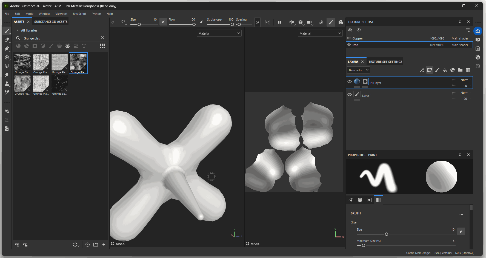

This will add a paint layer that I can use to paint both black and white on my model to hide or reveal parts of my mask

## Changing Brushes

If I want to change to a different brush:

1. Navigate to the brush section of the Assets browser
2. Select a new brush such as Dirt 1
3. Click on your model to paint with new brush

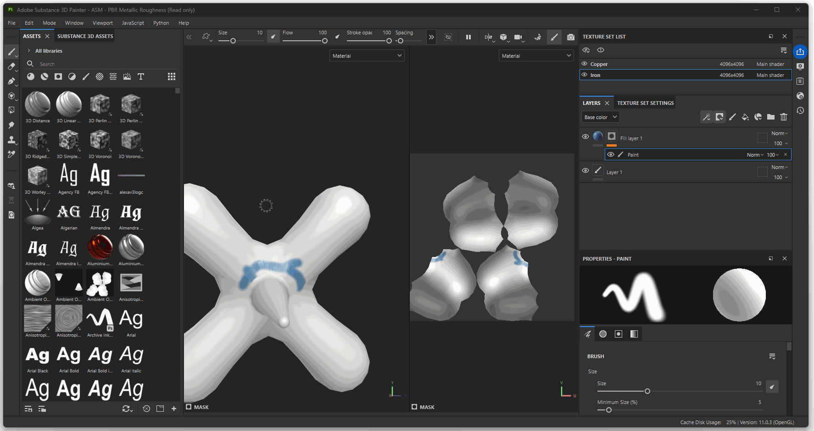

## Generators

Generators are a powerful tool within Substance Painter that allow us to create procedural material effects. Procedural here means that instead of creating masks or materials based on painting them manually, that are created by looking at the shape of our model through an algorithmic process.

A very common generator is the dirt generator.

**To add a dirt generator:**

1. Click on your mask and navigate to the Layer Stack button
2. Press “Add generator”
3. Press the Generator slot in the Properties section.
4. Select “dirt”

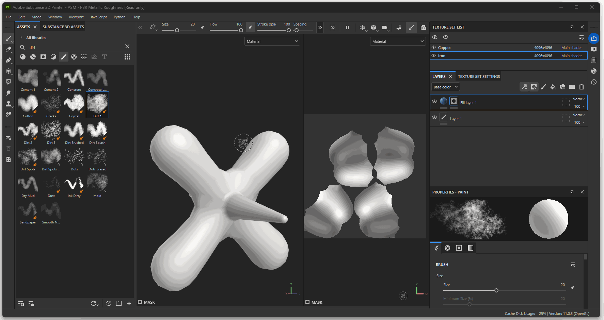

The dirt generator will create a procedural texture that finds crevices or other edges of our model and makes the texture mask of those areas more white to create a greater build up of dirt in those areas.

**We can adjust a variety of parameters for our dirt including:**

- Dirt Level (how much dirt)
- Dirt Contrast (how diffuse is the dirt across the material)
- Grunge Amount (how much general smudginess)
- and others!

## Materials and Smart Materials

The amazing part about substance painter is that it has a variety of prebuilt material bases that you mix and edit to easily create complex materials.

These are separated into two types of materials: Material and Smart Materials

### Materials

With the Materials section of the Assets browser, we have a variety of basic materials we can use on our model. These materials will consist of a single layer with baked or procedural textures that can be changed and adapted.

**Example:**

1. Click and drag the “Ground Sand” material onto your model.
2. Click on the “Ground Sand” layer.
3. Within the parameters of this layer you can affect the “Sand Color”, “Pebbles Density”, and a variety of other parameters. Notice also you can change where the layer affects the color, height, rough, and metal of your material.

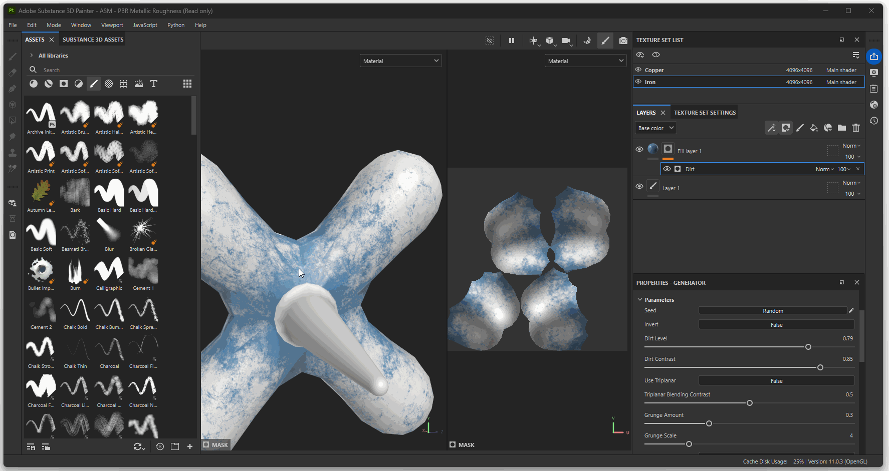

### Smart Materials

Unlike basic Materials with substance painter, Smart Materials use the mesh maps that we baked earlier to create procedural materials across your model.

**Example:**

1. Navigate to the Smart Material section of your Assets browser.
2. Click and drag the “Machinery” smart material onto your model

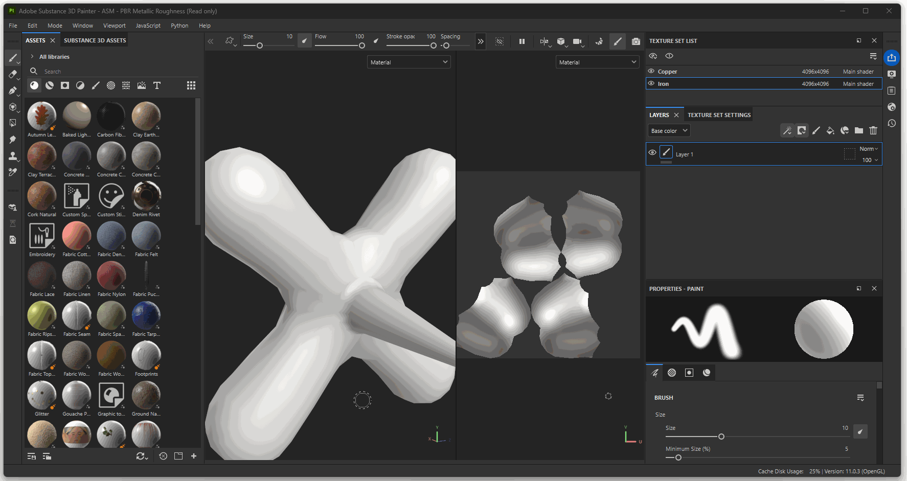

We can see in our layer editor that this smart material only consists of a folder with a variety of materials within the folder that we can edit and adjust.

**For example, if I wanted to change the color of my machinery metal:**

1. Navigate to the layer named “Metal Base” within the “Machinery” folder
2. In the Properties - Fill section, change the Base color of the material.

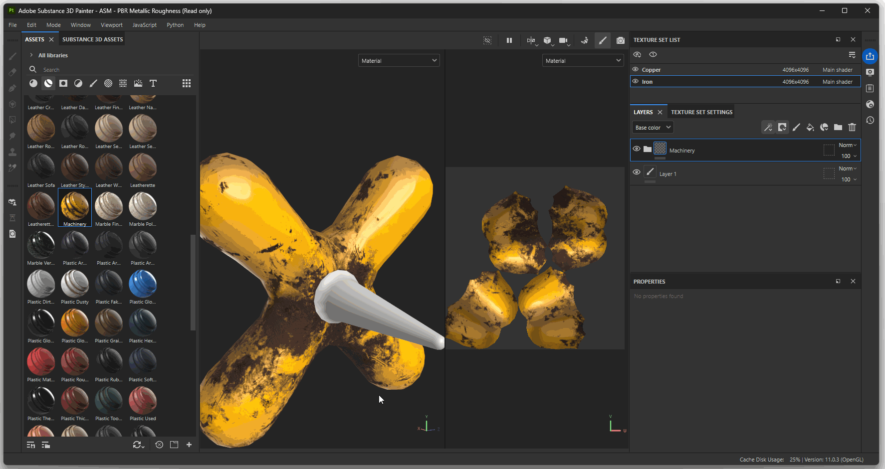

**As another example, I can begin to create these materials more complex by using the layer stack:**

1. Navigate to the layer named “Rust” within the “Machinery” folder
2. Click on the black mask
3. Click on the layer stack button
4. Press “add Paint”
5. Use the “Dirt 1” brush or another using either black or white to add or remove rust to your model

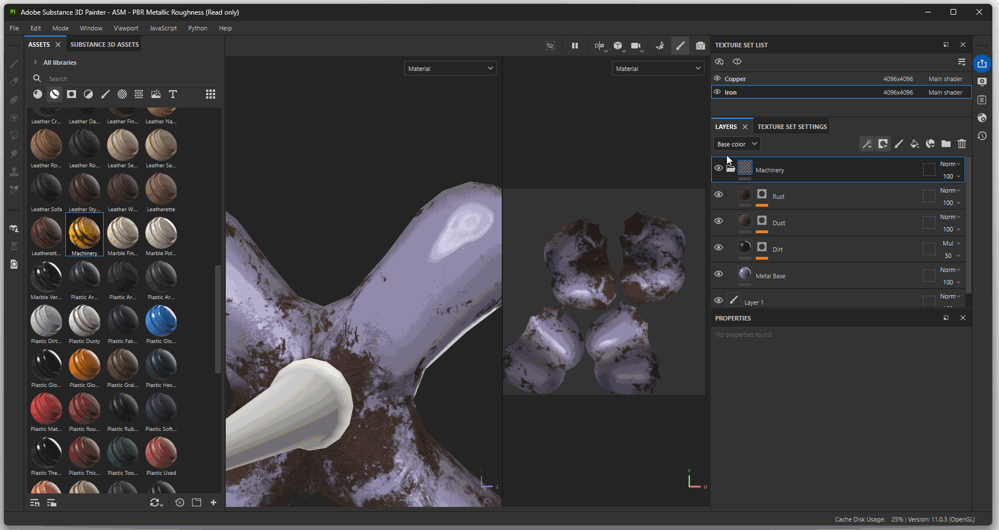

## Saving

You can save your Substance Painter file by either navigating to file save, or by pressing ctrl+s.

It is often a good idea to save your Substance Painter file within your Maya project folder for easy access.

## Export Textures

When you finish painting in Substance Painter, we need a way to export these textures from Substance Painter and bring them into Maya.

**To export textures:**

1. Navigate to File > Export textures
2. In the Output directory dropdown, select your Maya project Source Image folder.
3. In the Output template drop down, select “Arnold (AiStandard)”
4. Press Export

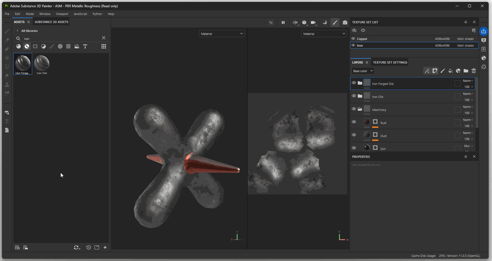

## Importing Substance Materials into Maya

Importing Substance materials into Maya used to be a long and tedious process. With updates to the Substance plug-in within Maya, this has become much easier.

Importing materials into Maya does contain a number of steps:

1. Make sure Substance Plugins are activated
2. Import texture maps
3. Rename material in Hypershade
4. Select object or faces
5. Assign new material

### 1. Substance Plugin

In order to import textures from Substance Painter, we need to make sure the Substance Plugin is active:

1. Navigate to Windows > Setting/Preferences > Plug-in Manager
2. Search for “Substance”
3. Check the both boxes for Substance.mll, substanceconnector.mll, substancemaya.mll, substanceworkflow.py.
4. Press “Close”

### 2. Import Substance Texture Maps

The next step is to import our texture maps we exported from Substance Painter.

1. In your top menu bar, navigate to Substance > Apply Workflow to Maps
2. Press “Select Multiple Maps”
3. Navigate to where your maps are saved
4. Ctrl-click your baseColor, normal, roughness, metallic, height, and emissive maps for a single material.
5. Press “Apply”

### 3. Hypershade

Hypershade in a window in Maya that allows us to manage a variety of parts of our scene including our materials. Within Hypershade, we can rename materials and assign materials to our models.

**Rename materials in Hypershade:**

1. Open Hybershade by click on the green shader ball button at the top of your Maya UI
2. Click on your material within the top material section, you should be able to identify your material by its appearance or by a name similar to aiStandardSurface1.
3. In the property editor on the right side of your screen, change the name of your material. Oftentimes it is good to name your material, nameOfMaterial_Substance.

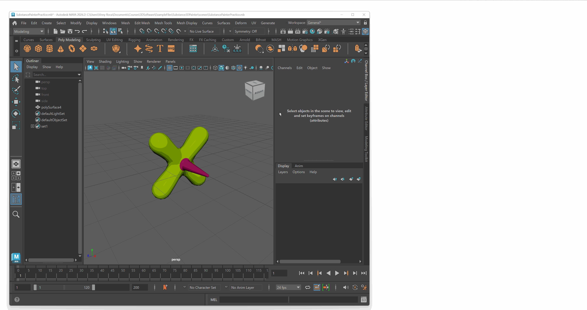

Now that we have renamed our material, we need to assign it in Maya.

If our model is separated by preexisting materials, we can select the faces or objects associated with that material to easily swap to our new substance material.

**To select faces that have old material:**

1. In Hypershade, navigate to your old material
2. Hold right click on the material on open the marking menu and select: Select Objects with Material.
3. In your viewport, you should see the faces that have that material selected.

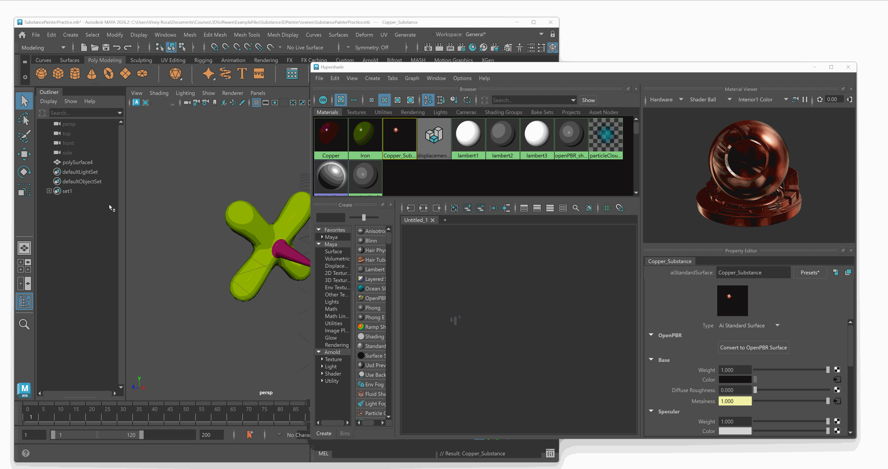

**To assign new material:**

1. With the faces or objects selected
2. Hold right click on your new Substance Painter material, select “Assign Material to Selection”
3. You should now see in your viewport your objects have your new material.

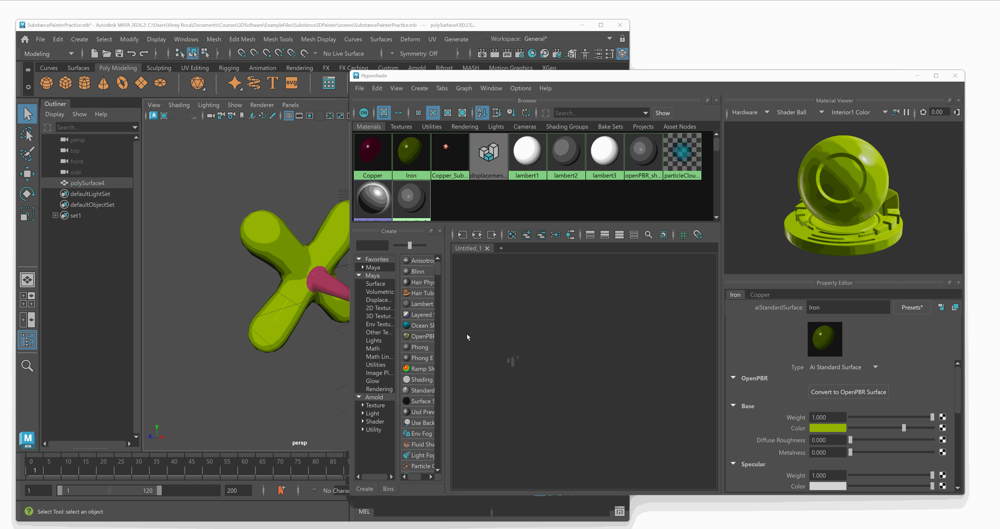

## Rendering to See our Material

Although we will be learning more about rendering in the next section of this course, it is good to preview our material using a basic rendering set up.

Rendering is the process of using lights, materials and cameras to calculate an image of our Maya Scene.

To begin, we need to bring a light into our scene.

Let’s bring in a basic Physical Sky light. This will mimic the light of the sun and sky.

To create a Physical Sky light:

1. In your top menu bar, navigate to Arnold>Lights>Physical Sky

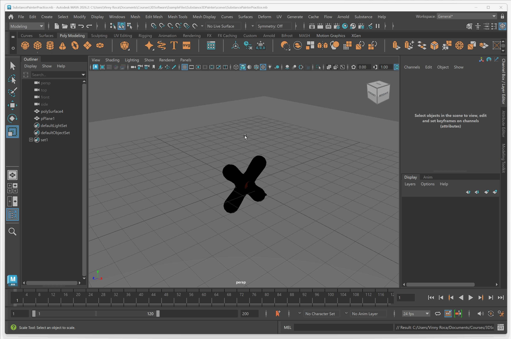

Now that we have a Physical Sky in our scene, we need to preview what our image looks like. To do this, we can create a basic render.

To create a basic render in Maya:

1. Position your camera in the scene to have a clear view of your object.
2. Press the Arnold RenderView button (it looks like a Clapper Board with an Eye)
3. Press the Play button in the upper right corner of the RenderView to render an image.

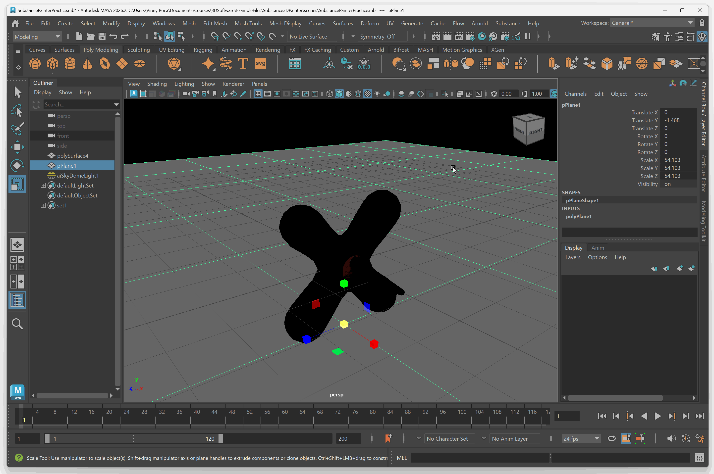

You can use the Elevation and Azimuth within your aiPhysicalSky settings to change the rotation and elevation of your Sun.

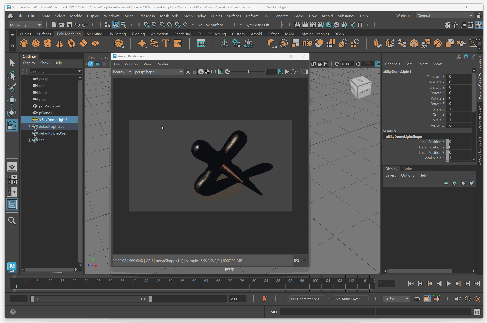
