# ZBrush Continued

## Blockout

When creating a complex model within ZBrush, it is best to start out with basic shapes to create general form and silhouette. There are many approaches to blocking out forms in ZBrush, including using [Z-spheres](https://www.youtube.com/watch?v=lFOIdb6wSU0). One simple method is to append basic shapes together to create the form of your mesh.

---

For example, if I wanted to sculpt a toad using this set of reference images:

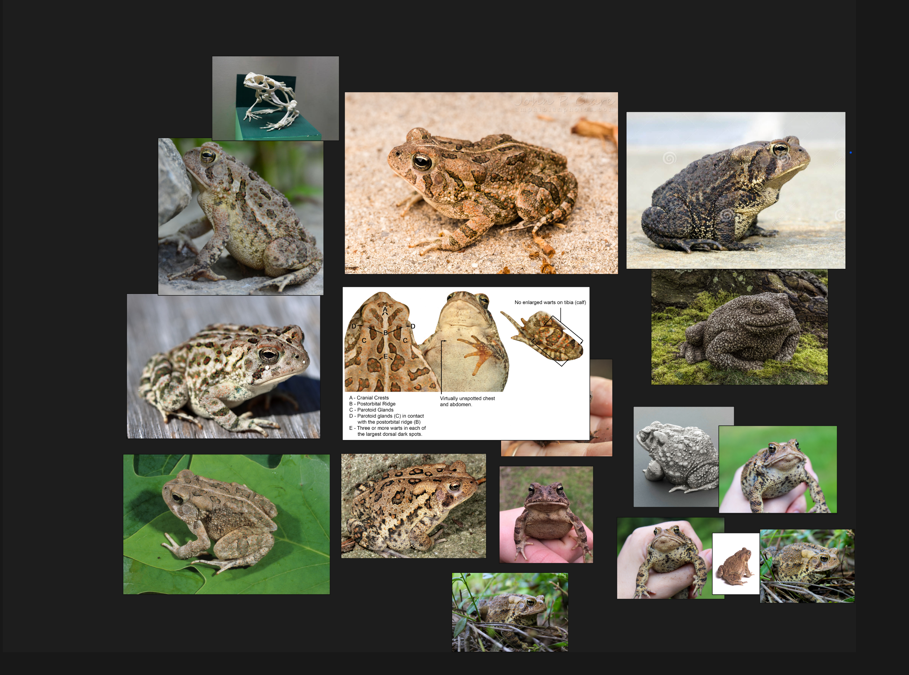

---

I could break down one of the reference images into basic 3D shapes and create those shapes within ZBrush: 

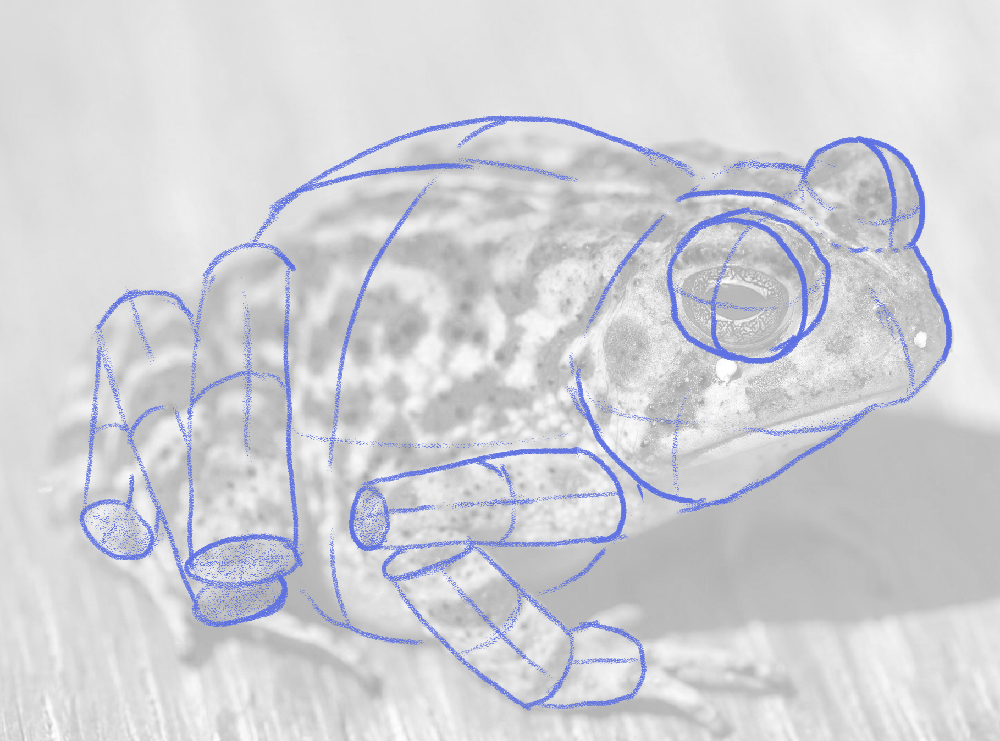

## Subtools

Tools within ZBrush are made up of Subtools. You can access the subtool menu from the Tool menu on the right side of your UI:

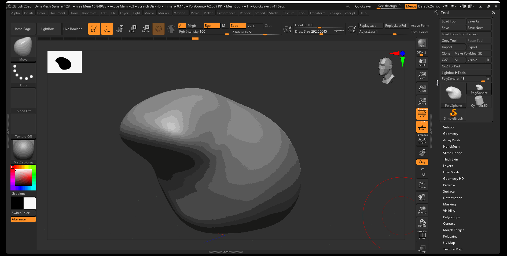

### Append

Adding an additional Subtool in ZBrush is called appending a Subtool.

To append a subtool:

1. Navigate to the Tool Menu
2. Navigate to Subtool Menu
3. Click Append and select the object you want to add to your Tool

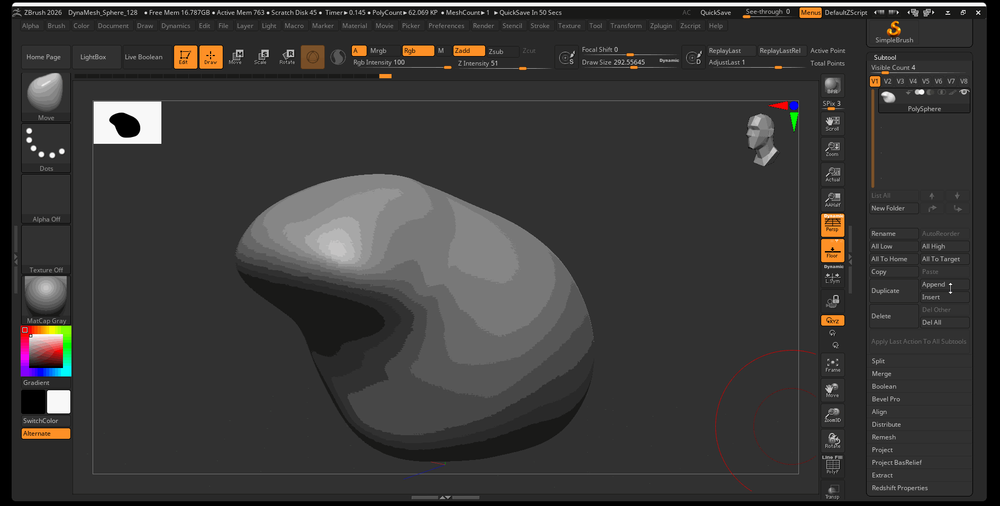

Note that when you add a new subtool, it is not automatically selected. You can select a subtool from the Subtool Menu. By default, for newly created subtools, symmetry is turned off.

### Duplicate

Duplicate a subtool by pressing the Duplicate button in the subtool menu:

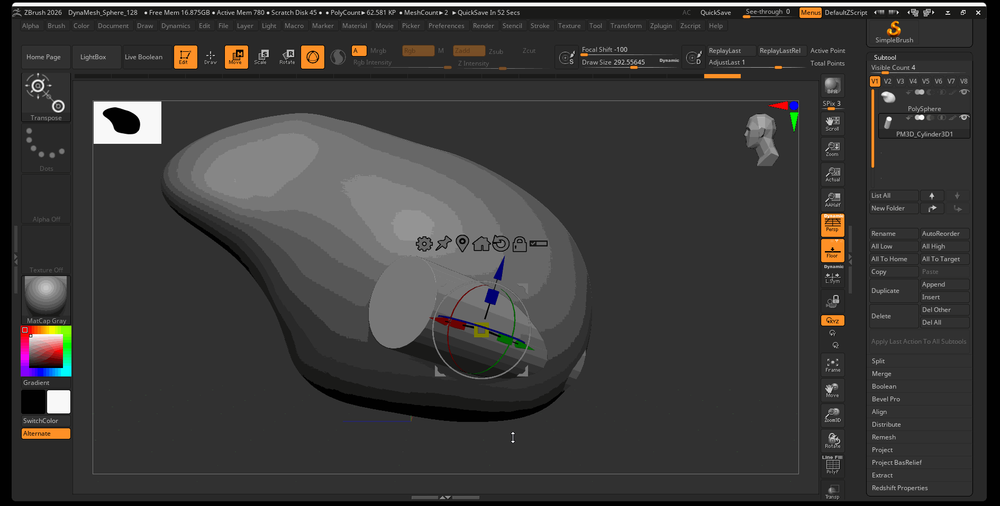

### Toggle Visibility

Toggle the visibility of a subtool by pressing the eye icon on your subtool in the subtool menu:

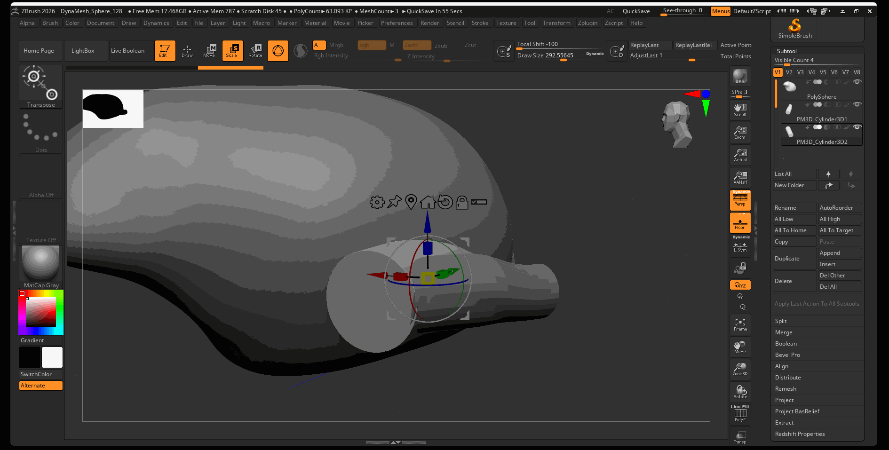

### Merge

Subtools can be merged together into a single subtool by using the Merge menu.

#### Merge Down

Merge Down will merge a selected subtool into the subtool below it in the subtool menu:

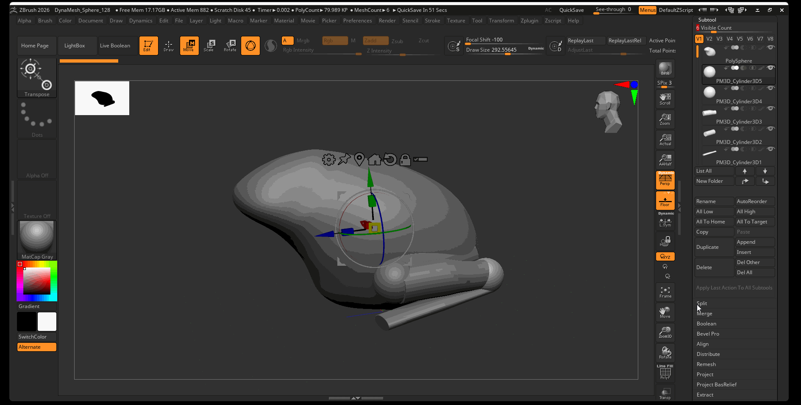

#### Merge Visible

Merge Visible will merge all visible components into a new Tool that can be accessed from the tool menu:

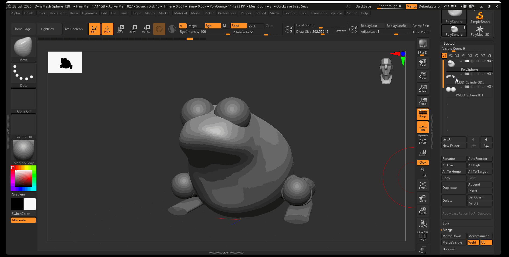

### Split

Although merging subtools cannot be undone, you can split apart disconnected pieces of geometry into separate tools using Split.

To split a subtool by parts:

1. Select the Subtool you want to split
2. Navigate to Tool > Subtool > Split
3. Select Split to Parts

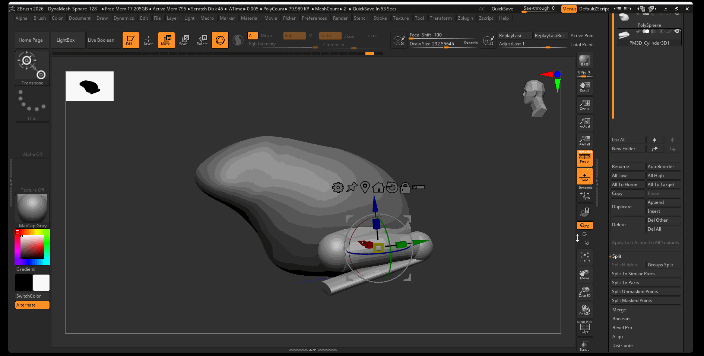

### Mirror and Weld

We can mirror and combine subtools by using Mirror and Weld. The Mirror and Weld tool will create a duplicate of a subtool, mirror it across a selected axis, and merge the two subtools together, welding any overlapping vertices.

To mirror and weld a subtool:

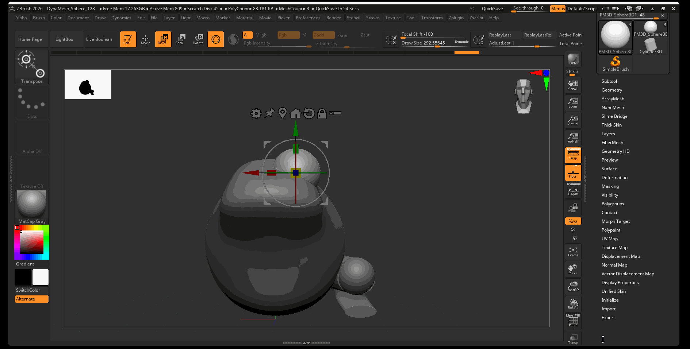

1. Select the subtool you want to mirror
2. Navigate to Tool > Geometry > Modify Topology
3. Select Mirror and Weld

If you want to mirror your model in the other direction, first navigate to Tool > Deformation > Mirror to mirror your model. After the model is mirrored, then use Mirror and Weld.

## Sculptris Pro

In addition to using DynaMesh to create more complex geometry, we can also use Sculptris Pro to dynamically add geometry to our model. Sculptris Pro, by default, will dynamically add geometry to your model based on the size of your brush. A smaller brush will create more fine geometry while a large brush will create more blocky geometry.

To activate Sculptris Pro:

1. Click on the Sculptris Pro button in the Top Shelf.
2. Draw on your model like normal, and change your brush size to add different levels of geometry.

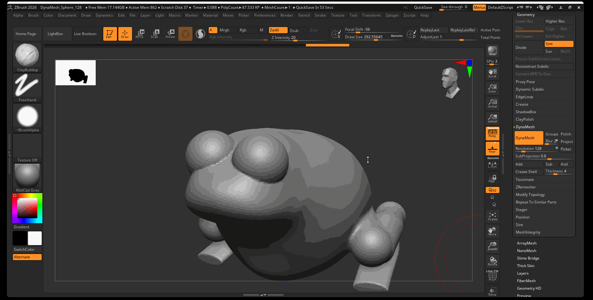

Sculptris Pro is very effective when used with DynaMesh. Use Sculptris Pro to add fine details or make sculpting certain sections of your model easier, then use DynaMesh to re-mesh your model to a workable resolution.

### Sculptris Pro and SnakeHook2 Brush

Sculptris Pro works particularly well with the SnakeHook2 Brush. The SnakeHook brush allows you to pull out parts of your typology to create hook-like forms.

Activate the SnakeHook2 brush by using the hot key: B > S > K

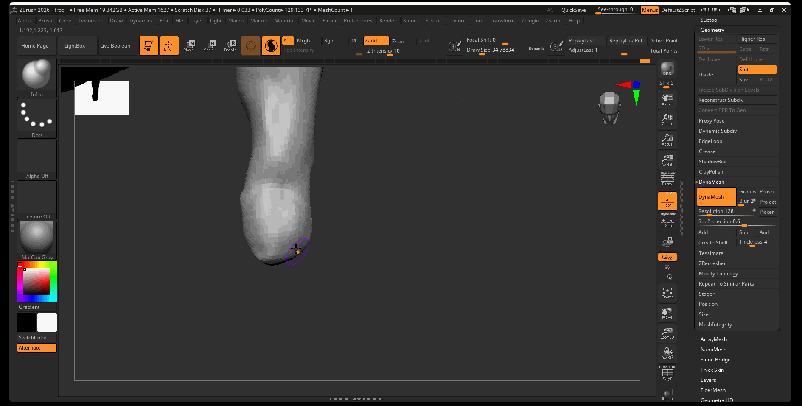

### Sculptis Pro and Inflate

Sculptris Pro also works well with the Inflate brush. Use the inflate brush on thin parts of your geometry to inflate them like a balloon. In the below example, fingers of a toad we create using the SnakeHook2 brush, then those fingers were inflated using the Inflate brush.

Activate the Inflate brush by using the hot key: B > I > N

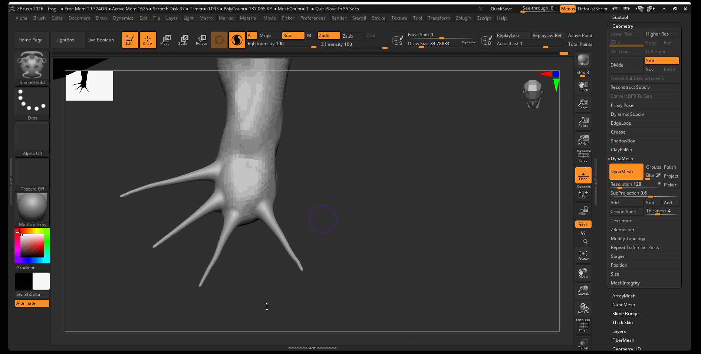

## Perspective Camera

By default, ZBrush displays our model using a perspective camera with a 50 mm camera. You can toggle between a perspective and orthographic camera by pressing the Persp button in the Right Shelf. The orthographic camera is particularly helpful when trying to align objects to the same plane:

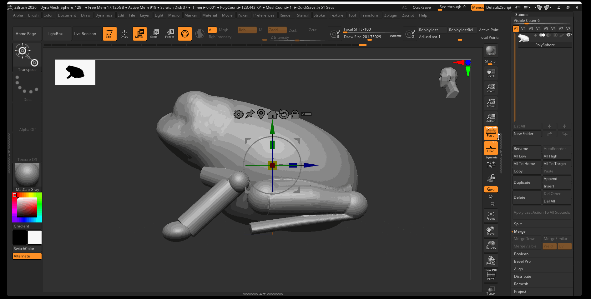

## Materials, Color, Wax Modifier

### Materials

ZBrush defaults to a gray material called MatCap Gray. You can change the material of your displayed model by using the Material Menu in the Left Shelf.

Some common ZBrush materials include:

- MatCap Gray: Good all around material for seeing large forms of your model.
- MatCap Red Wax: The classic ZBrush material, good for seeing fine details on your model.
- SkinShade4: This material is great for viewing textures, or if you want to create wax-like materials.

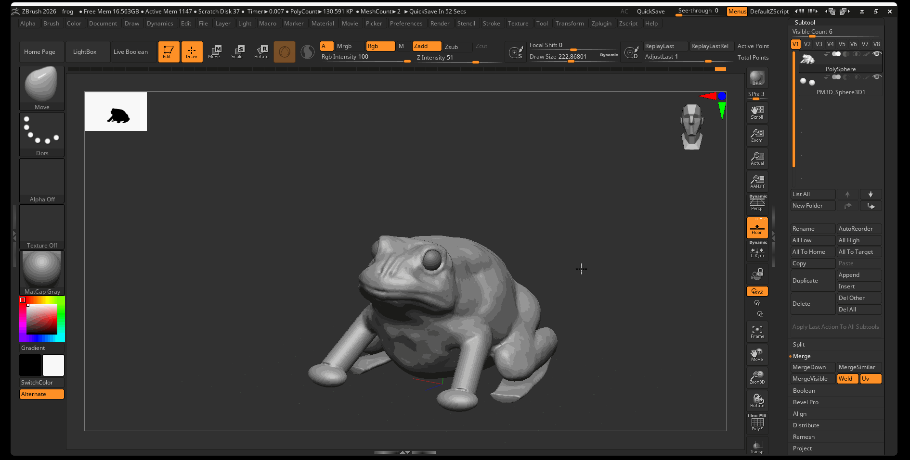

### Color

You can change the color of your model by using the color palette on the left side of the UI or by selecting one of the black and white color palettes, changing the color, and pressing SwitchColor.

### Wax Modifier

When using the SkinShade4 material, we have access to the wax modifier which will give our model the appearance of a waxy surface.

To allow for wax rendering:

1. Navigate to Render > Render Properties > Select Wax Preview
2. Navigate to Material > Wax Modifiers > Set the Strength between 80-90

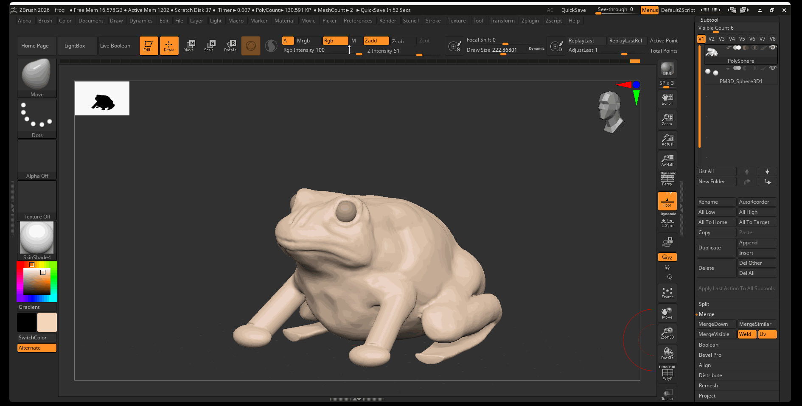

## Move Topological Brush

The Move brush is great for moving large parts of your model, however, when you are trying to move two separate parts of your model that are close to each other, the move brush is not always the best tool. The Move Topological Brush is a “smart” move brush that identifies separate parts of your topology and lets you move them independently.

To activate the Move Topological brush, use the hot key: B > M > T

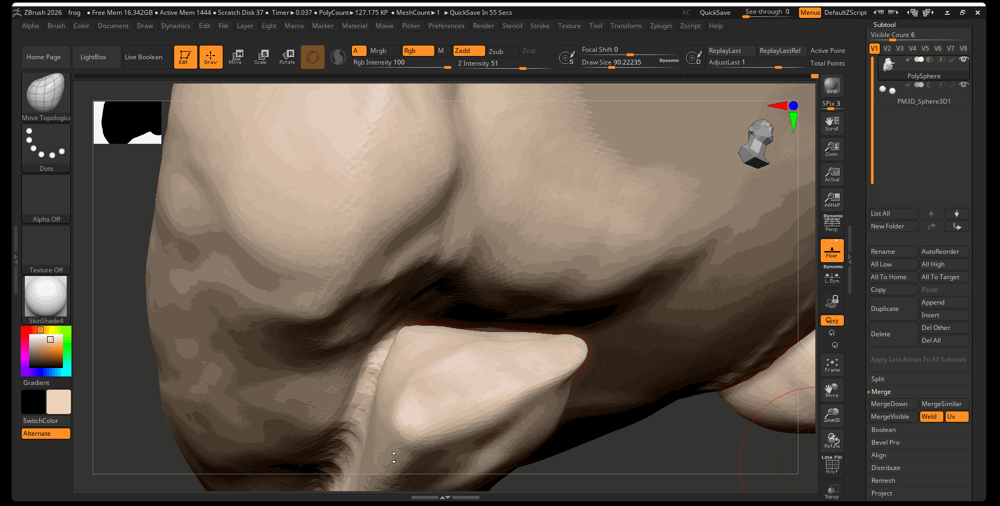