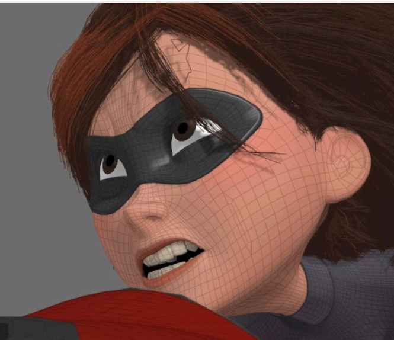
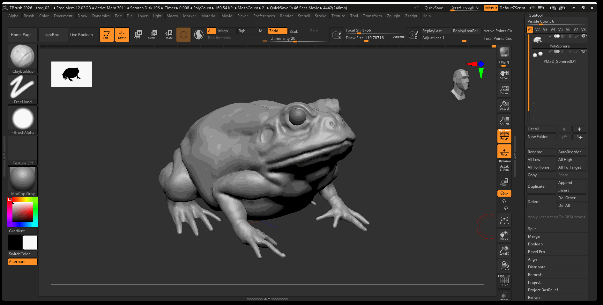
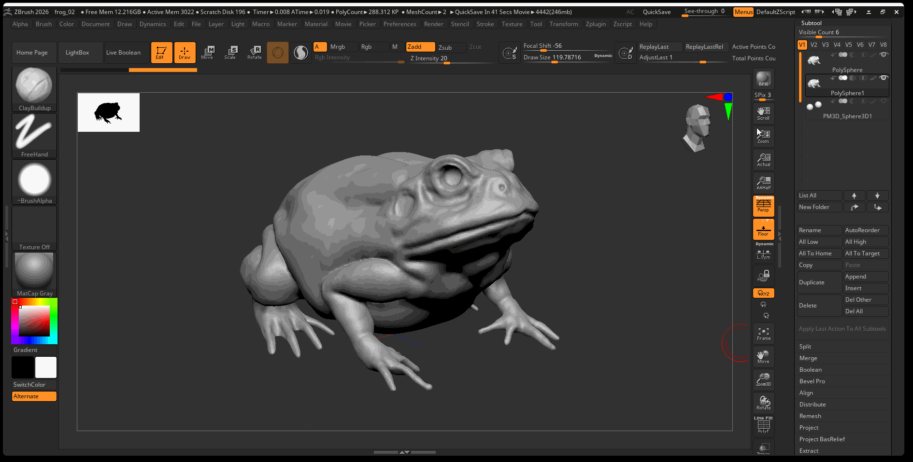
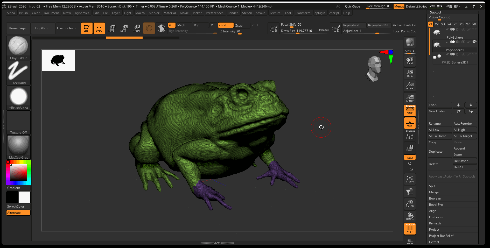
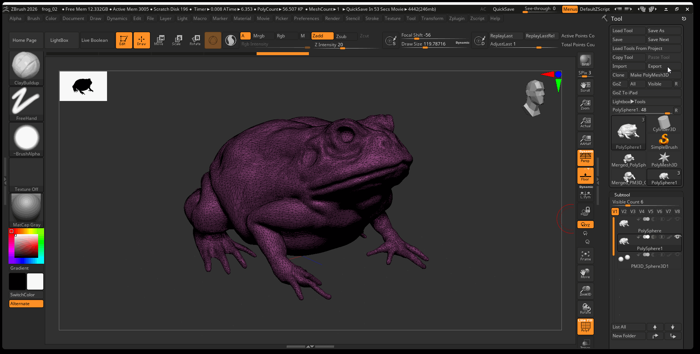
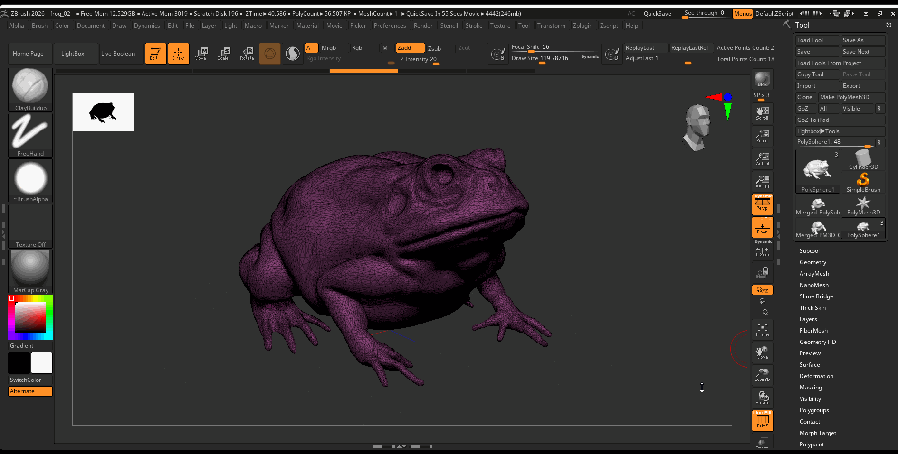
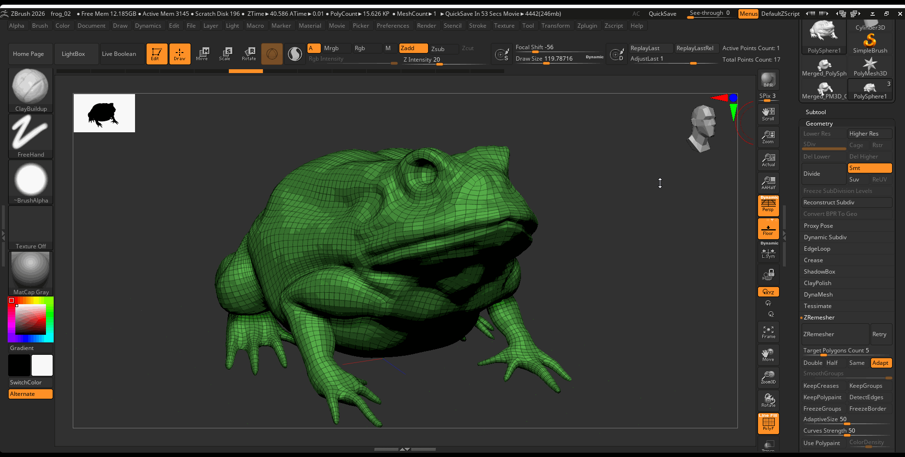
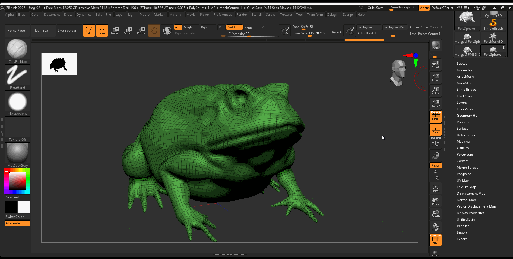
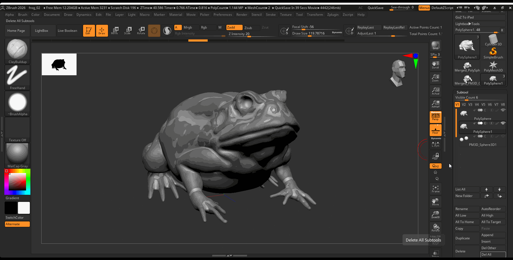
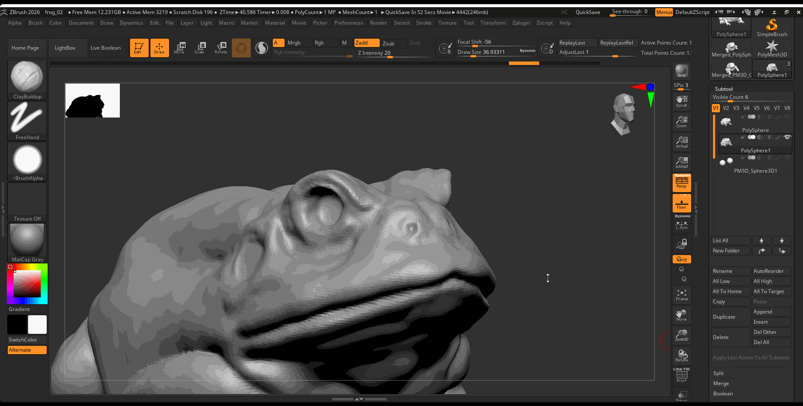

# Retopology and Projection

## Process

Once you have sculpted all of the primary and secondary forms of your ZBrush model, it is best practice to retopologize the mesh before you continue working. Retopology is the process of taking a dense mesh and simplifying it to a quadded mesh that can be used in either games or animation. There are two main ways to retopologize a ZBrush sculpt. You can either export the model and retopologize as well as unwrap the model in Maya, or, more simply, you can use the ZRemesher within ZBrush to quickly create a clean topology.

### ZRemesher vs. Maya

The main reason we would retopologize our mesh in Maya is to have more control over the flow of our topology. This is typically only important if you are planning to animate your 3D model. When animating a 3D model, we want the topology to deform in certain ways. For example, it is common practice to put a variety of edge loops around the mouth, so when the mouth is animated it deforms more naturally.

Returning to an example from earlier in the course, we can see now in the Mrs. Incredible topology, the artist purposefully retopologized the model to allow for specific defamation of the face when animating:

<figure> <figcaption>Face Topology of Mrs.Incredible from The Incredibles.</figcaption></figure>

Retopologizing in ZBrush is a two step process. The first step is to retopologize our mesh as explained above. The second step is called projection. In this process we project the high resolution details of our sculpted mesh onto our low-poly version.

## Retopology

### Duplicate

To begin, create a duplicate of the Subtool you want to retopologize. Turn off the visibility of your high poly model and other subtools.

### Decimation Master

It is easier to retopologize your model whether in Maya or ZBrush after your model has been decimated. The decimation master plugin in ZBrush will attempt to create a lower poly count version of your model while preserving all of your detail.

1. Preprocess your model: Navigate to Zplugin > Decimation Master > Preprocess Current 
2. Decimate your model: Navigate to Zplugin > Decimation Master > Decimate Current 

## Retopology in Maya (Optional)

If you want to retopologize your model in Maya you can follow this basic workflow:

1. Export
2. Retologize
3. UV Unwrap
4. Export and Import into ZBrush

1. To Export and model from ZBrush, select your model and navigate to Export in the Tool panel. 
2. Retopologize your model: you can follow this [tutorial](https://www.youtube.com/watch?v=xpDWta5O3n8) by flipped normals.
3. UV Unwrap your model as we learned previously.
4. Export your model from Maya and import it into ZBrush, you can then follow the projection part of the tutorial.

## ZRemesher

Navigate to Gemometry> ZRemesher > Press ZRemesher

Ideally your remeshed model should be low enough to preserve all the major details of your high resolution model while having a poly count of around 10k to 30k polygons. You can adjust the amount of topology created from the ZRemesher by adjusting the Target Polygons Count. 5 is typically a good number, but if you want less topology you might move this value to 2 and might increase it to 7 if you want more geometry.

## Projection

The next step is to reproject our high resolution detail onto our low resolution model.

### Subdivide

Begin by subdividing your remeshed model to around 1 million polygons

Navigate to the Tool panel > Geometry > Press Divide 3 or 4 times

**Subdivide Hotkeys**

- `Ctrl + D`: Subdivide Model
- `D`: Move up level of subdivisions
- `Shift + D`: Move down levels of subdivision

## Project

1. Turn on the visibility of your high poly model. 
2. With your low poly model selected and it set to its highest level of subdivision , navigate to Subtools > Project 

## Turn off Lower Resolution on Rotate

You might notice that when you rotate your model, it shows a lower level of detail. This can be helpful for performance, however,  you might be rotating to get a better look at your model. We can turn off lower resolution on rotation by navigating to:

Preference > Performance > Increase QTransThreshold to 50

## Sculpting High Resolution Details

Once finished projecting our model, we can begin to sculpt more secondary and tertiary forms on our model. During this phase of sculpting, looking closely at the variety of details on your model. Use your subdivision to your advantage. For large details, use a lower level of subdivision. For small resolution details, use a lower level of subdivision.

Here is a video of the high resolution details I added to the frog model:

<iframe width="560" height="315" src="https://www.youtube.com/embed/eR6aQfnzLhs?si=lDOR4ZPG7xyZwi2z" title="YouTube video player" frameborder="0" allow="accelerometer; autoplay; clipboard-write; encrypted-media; gyroscope; picture-in-picture; web-share" referrerpolicy="strict-origin-when-cross-origin" allowfullscreen></iframe>

