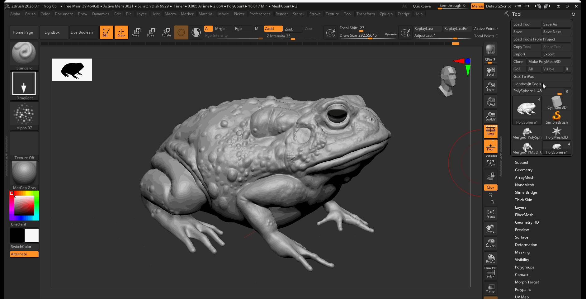
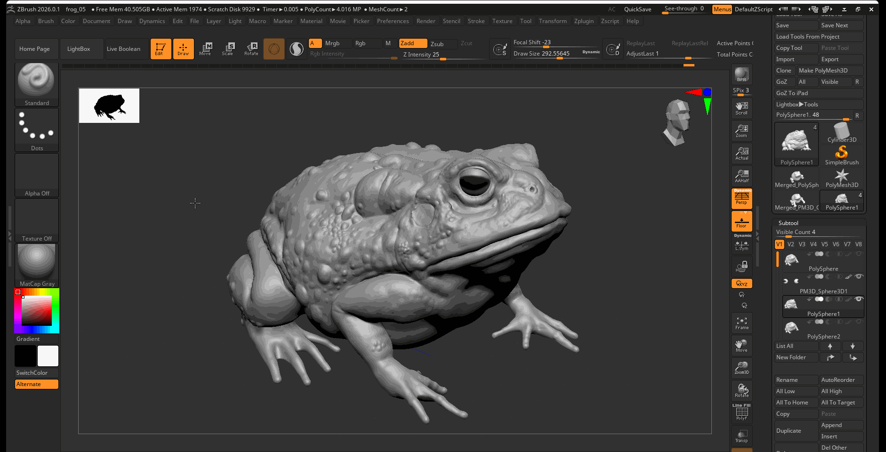
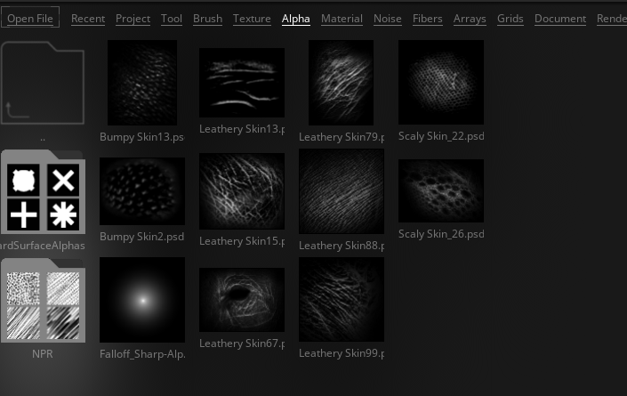

# Surface Details

When adding surface details to you subdivided zremeshed model, it is best to create a new layer to hold our high resolution detail.

## Layers

**To create a new layer:**

1. Set model to highest level of subdivision.
2. Navigate to layers in the Tool panel
3. Press the plus button to create a new layer
4. Press the record button on the new layer to record changes

## Creating Surface Details

Creating surface details involves either using a Drag brush or Color Spray Brush along with an alpha. For this Toad example, I make use of Alpha 07 to add skin texture to the Toad.

**To use a Drag bush:**

1. Set your brush to the Standard Brush
2. Select your brush stroke and set it to DragRect
3. Set your Alpha
4. Click and drag on your model to create different size alpha stamps
5. Adjust your Z Intensity to change the strength of your alpha stamp

**To use Color Spray:**

1. Set your brush to the Standard Brush.
2. Select your brush stroke and set it to Color Spray.
3. Set your Alpha.
4. Click and drag on your to spray the alpha texture across your model.
5. Adjust your Z Intensity to change the strength of your color spray

## Additional Alphas

The lightbox contains a series of additional alphas under than alpha tab:

