# 3D Scanning & ZBrush

Following from the previous tutorial on how to import a 3D scan into ZBrush, this tutorial will explore methods for sculpting and remeshing scans within ZBrush.

The same work flow from our previous ZBrush tutorial applies:

- Any major change to the form such as adding or removing large areas should be carried out before ZRemeshing your model. For example, in the 3D Scan below, the fingers of the statue are added before remeshing the model. Note that major changes to the form may disrupt the texture of your model.
- Tertiary details as well as surface detail are sculpted after the model has been remeshed.

## Rotating and Aligning Model

After your scan has been brought into Zbrush, it is important to rotate and align your model with the correct axes. In the example below, the model from the scan is tilted slightly at an angle. We can use the Shift+ Rotate hot key to lock our view to particular angles. Additionally, we can turn off perspective and use the Transpose tool to align our gizmo and rotate our model.

**To align your model:**

1. Use **Rotate** then Hold **Shift** to navigate to a side View > Press the **persp** button to turn off perspective   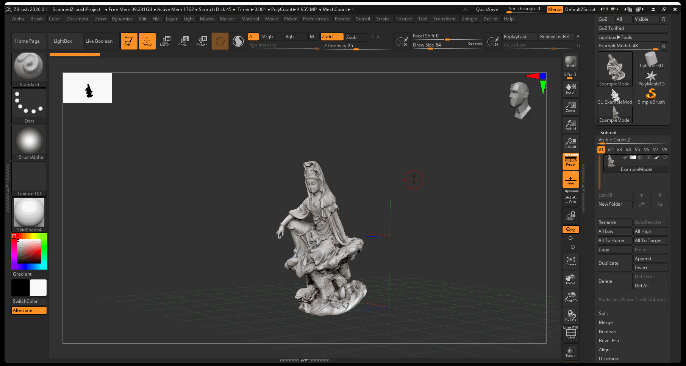
2. Turn on the **Transpose** tool using the **W** key > Press the **Unlock** button then the **Map Marker** to center pivot on model   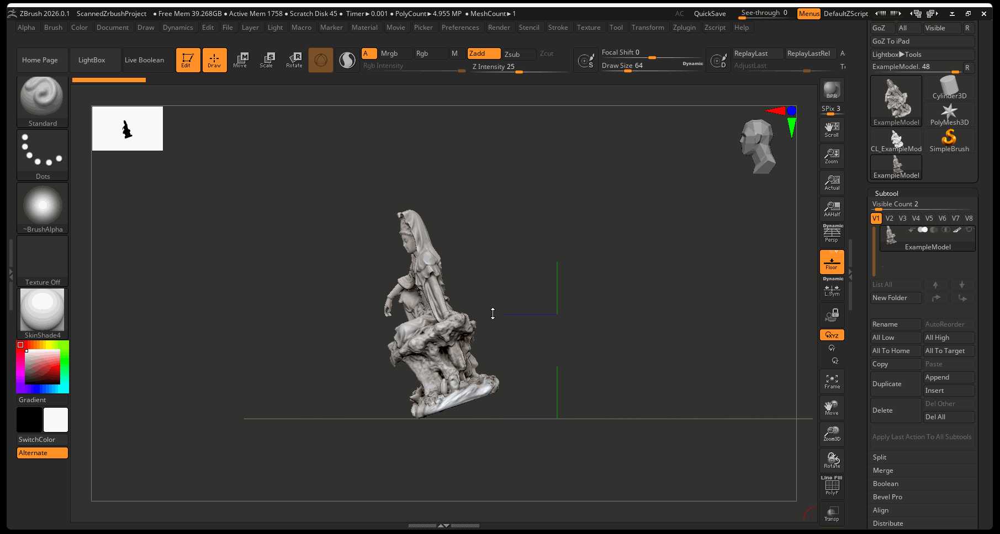
3. Press the **lock button** > **Rotate** Model to correct position then reset pivot by pressing **unlock** > **circle arrow icon**   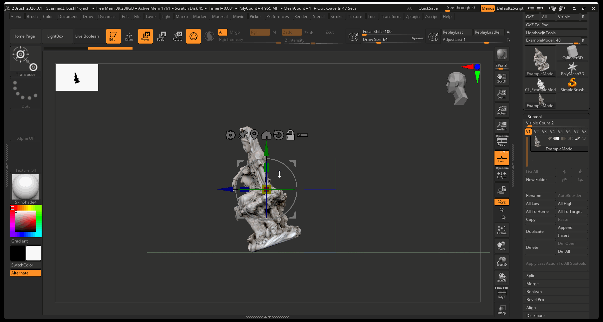
4. Press the Home button to move model to origin   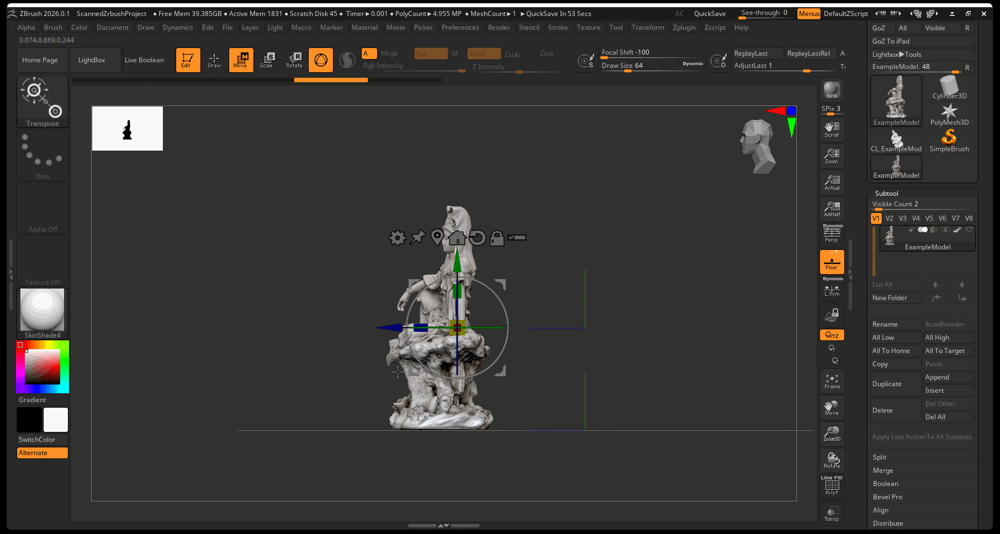

## Smoothing Model

After the model has been rotated, it is best to review any areas of your model that need smoothing:

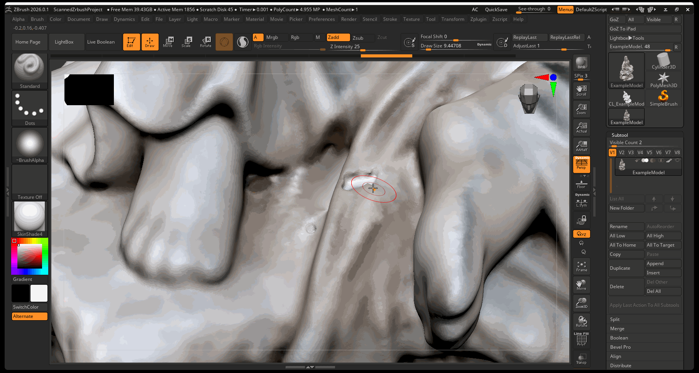

## Adding Additional Details:

Before retopologizing your model, you can add additional large details using sculpting techniques. In the example below, fingers are sculpted onto the model that were missed in the scanning process:

## Remeshing Model and Projecting Textures

Just like with our other sculpts within ZBrush, we need to reduce the poly count of our model in order to be able to render the model within Maya. To do this we will be following a series of steps:

1. Bake textures as Polypaint data
2. Duplicate model
3. Decimate model
4. ZRemesh Model
5. Unwrap new model
6. Subdivide model
7. Project Geometry and Polypaint data
8. Create texture from poly paint information

### 1. Bake Textures as Polypaint

Polypoint will provide vertices of your model with color - as opposed to a texture, poly paint stores color data as vertex color.

1. Make sure your model has around 1 to 2 million polygons
2. Navigate to **Polypaint** in tool menu > **colorize**
3. Make sure you can see the color data with the texture turned off

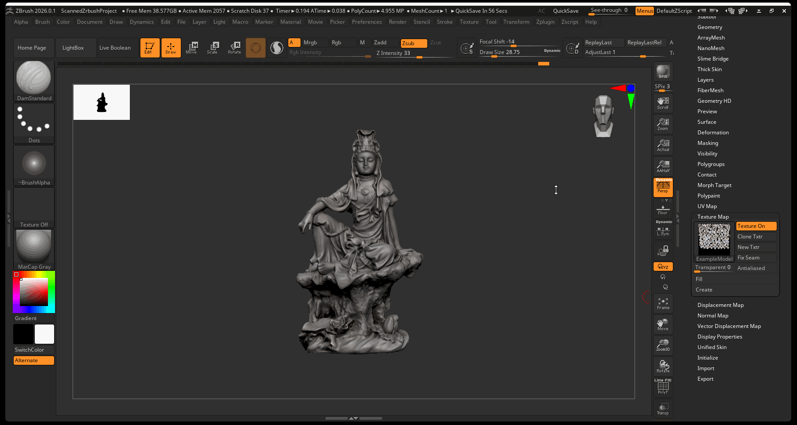

### 2. Duplicate Model

Duplicate your subtool and rename to indicate that it will be the remeshed model.

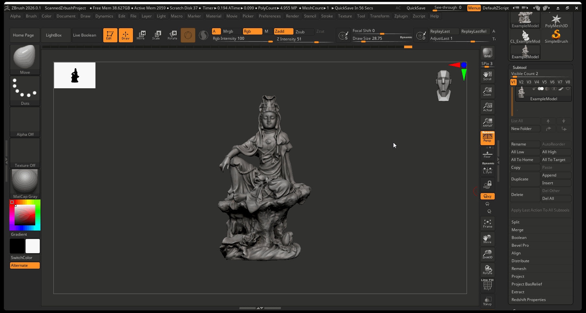

### 3. Decimate Model

1. With new model selected, navigate to **Zplugin** > **Decimation Master** > **Pre-process** current    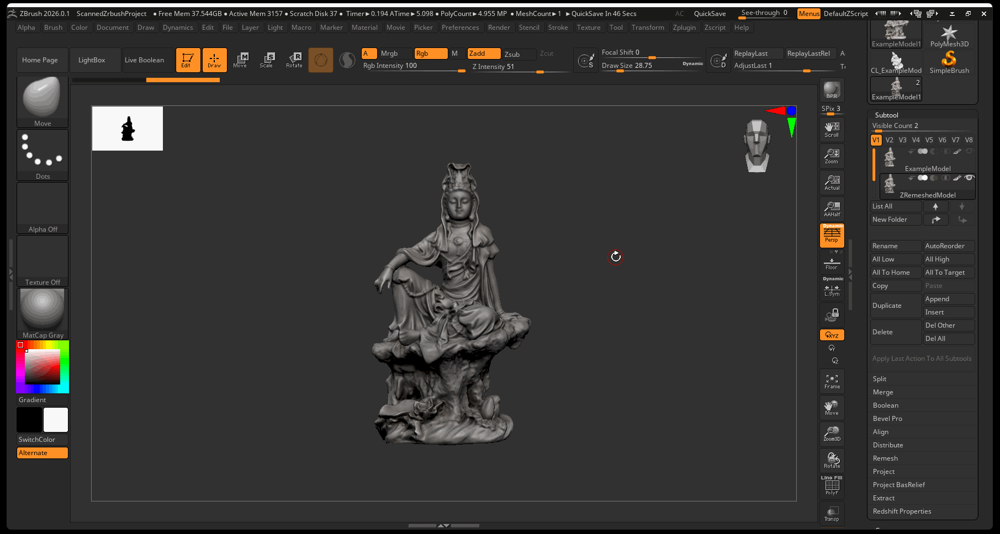
2. After the pre-process finishes > Navigate to **Zplugin** > **Decimation Master** > set decimation between **10 t0 20 percent** > press **Decimate Current**    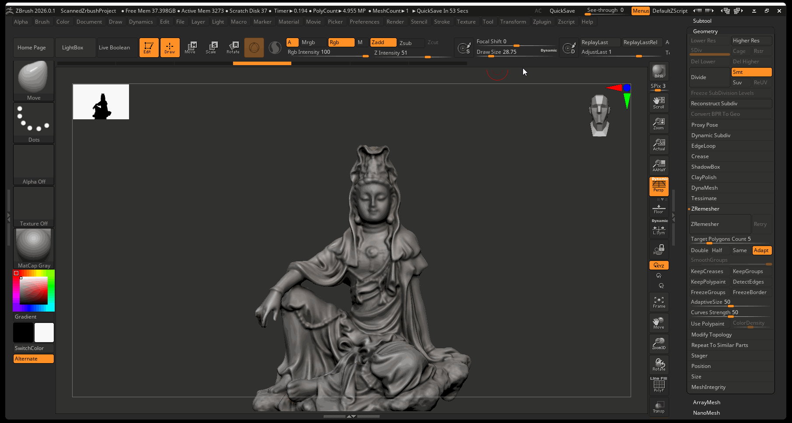

### 4. ZRemesh Model

- With decimated model selected, navigate to **Tool** panel > **Geometry** > **ZRemesher** > **ZRemesher**

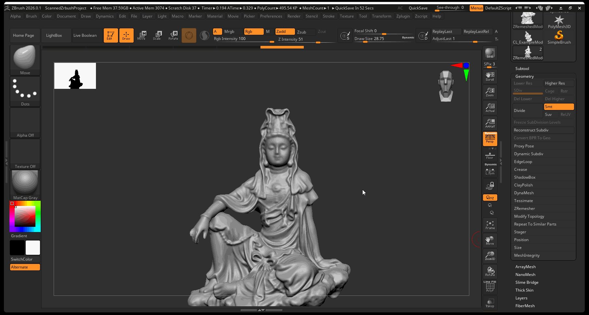

### 5. Unwrap Model

- With ZRemeshed model selected, navigate to **Zplugin** > **UV Master** > **Turn off Symmetry** > press **Unwrap**.
- You may need to check seams and use control painting as necessary.

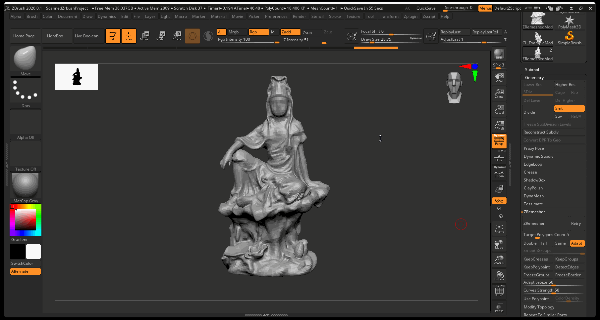

### 6. Subdivide

- Subdivide Unwrapped model to around 1 to 2 million polygons

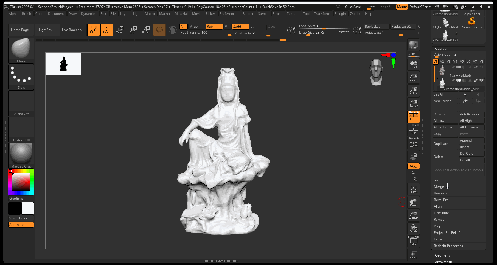

### 7. Project Geometry

1. Turn on original model > select new model > navigate to **Project** > **Project All**
2. Make sure poly paint date projects onto new model

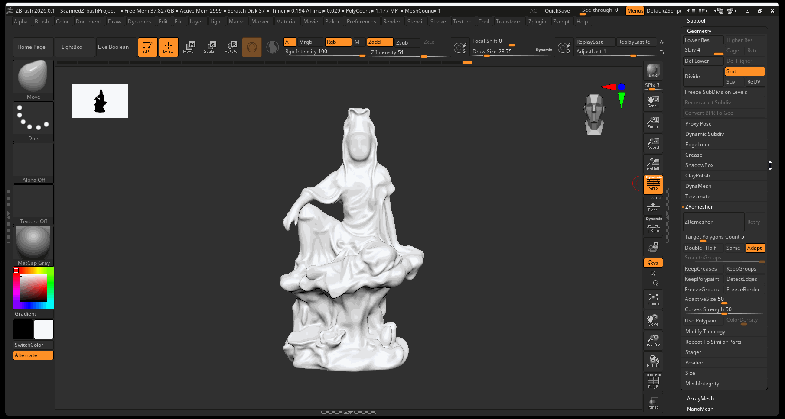

### 8. Create Texture

It is best to store your poly paint data in a Texture:

- Navigate to **Tools** > **Texture Map** > **Create** > **New From Polypaint**

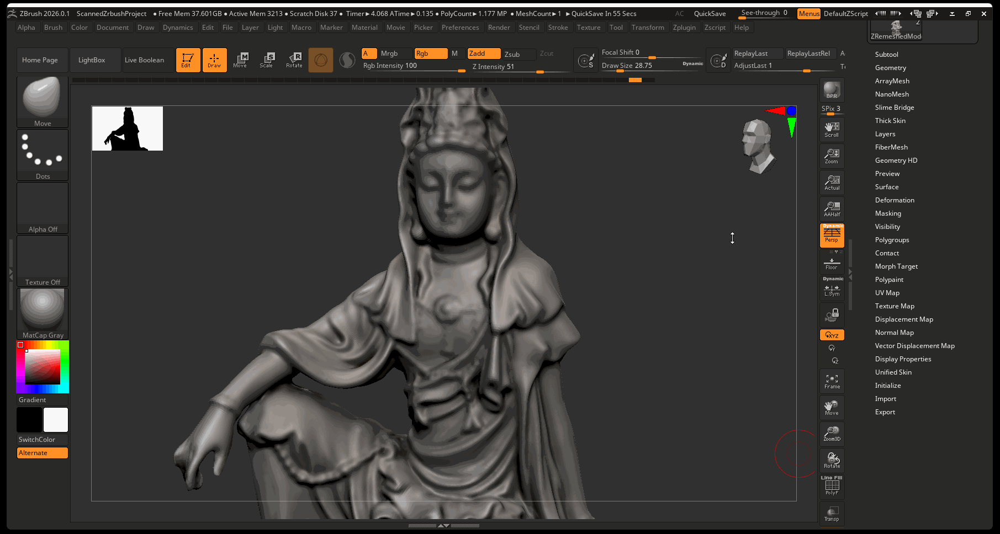

### Exporting Color Texture and Displacement

When you finish sculpting, you can export your color map data as well as a displacement map from ZBrush:

1. Navigate to **Zplugin** > **Multimap Exporter**
2. Make sure **Displacement** and **Texture from Polypaint** are on
3. Make sure maps are set to **4096** and the displacement setting are set to **32Bit/exr**
4. Press **Create All Maps**

## 3D Scan and Substance Painter

Bringing a 3D Scan into substance painter is the exact process of bringing any other high poly ZBrush model into painter (see ZBrush and Substance Painter tutorial):

1. Export a Low Resolution and High Resolution version of your mesh
2. Make a new Substance Painter file with your low resolution mesh.
3. Use the high resolution mesh to bake mesh maps

The only difference is we have a color texture map that we can use for our diffuse color within Substance Painter.

**To import color map into Substance Painter:**

1. Navigate to **File** > **import resources…**    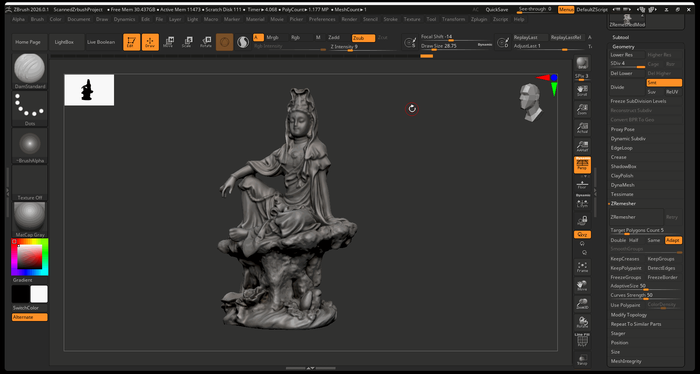
2. Select **Add Resources** and choose your color map from ZBrush    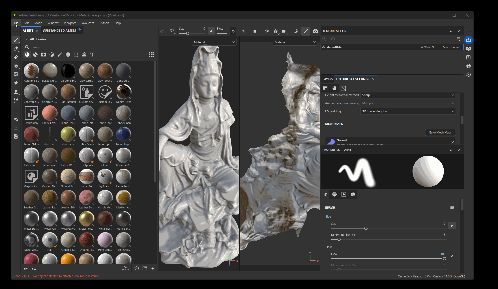
3. Set type from **Undefined** to **Texture**   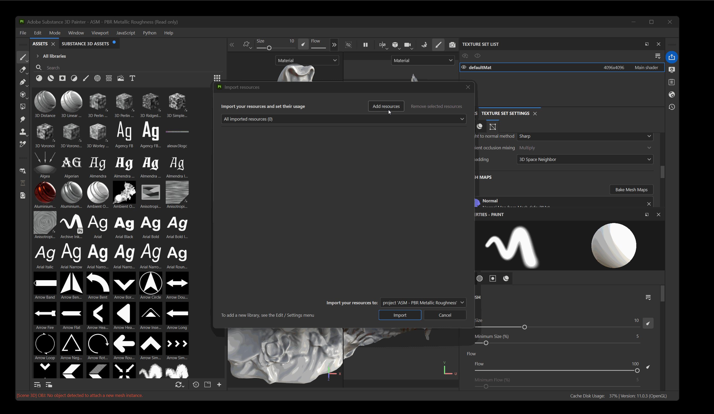
4. Press Import
5. Make a **new fill layer** on your model and turn color on
6. Drag your imported texture into **color**    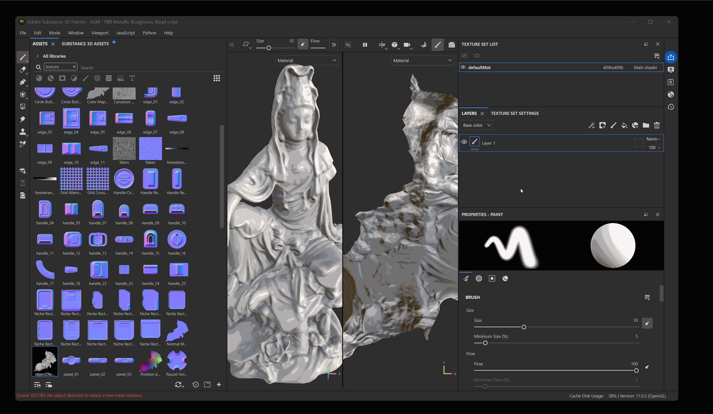

