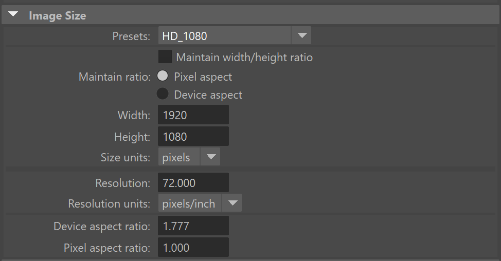
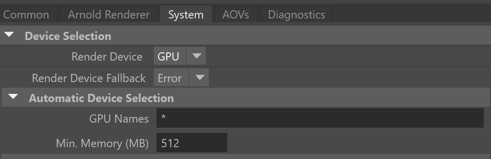
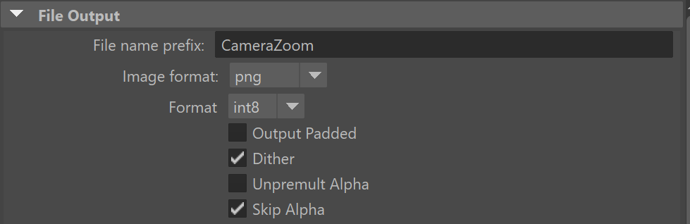
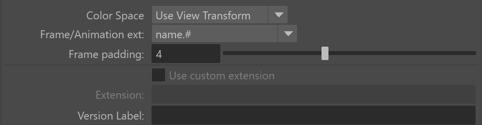
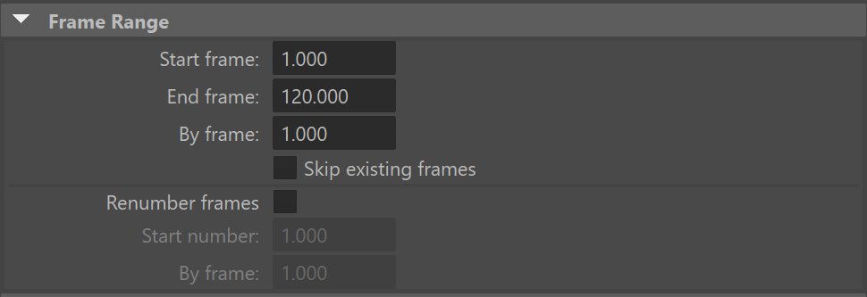
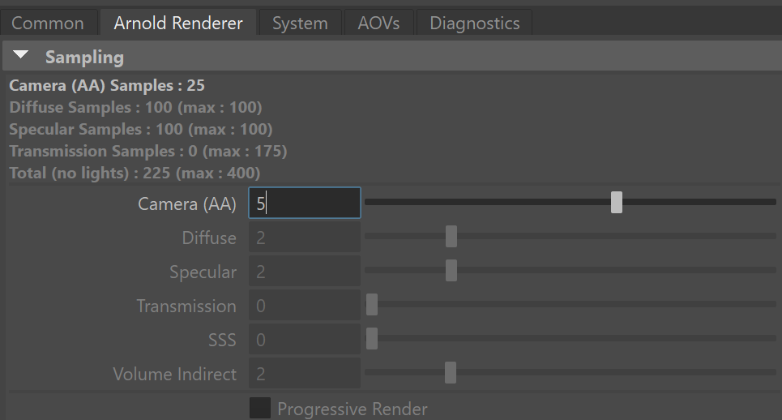
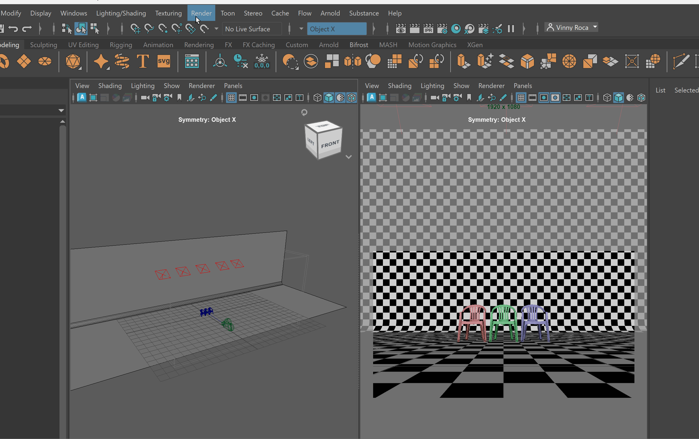
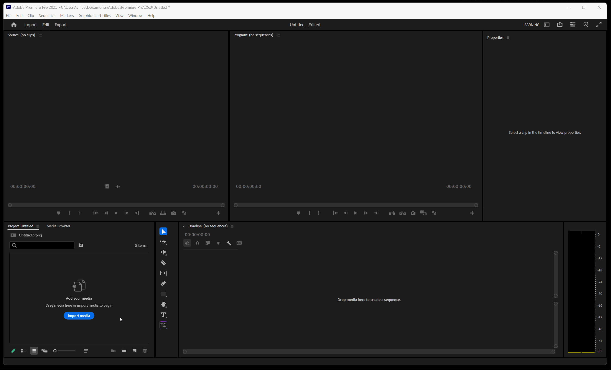
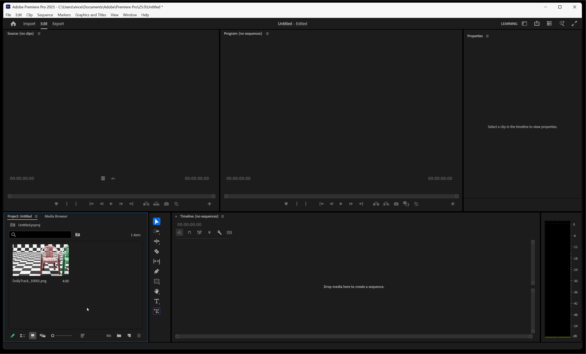

# Rendering Animations

## Render Settings for Animation:

To render each clip of final animation:

Make sure your project is set and Check the following render settings:
  
- Resolution is set to HD_1080 

- Renderer is set to GPU 

- File name of animation is set and img set to correct format 

- Frame/Animation ext: is set to name.# 

- Frame Range is set to the correct range (dependent on your animation) 

- Sampling is set between 4 and 6 (increase if render produces noise)

 

## To Render a Sequence

In the Rendering Workspace, navigate to Render > Render Sequence > Settings Box

Check the Current camera is the correct camera and press Render Sequence

## Importing Image Sequences into Premiere Pro

After your image sequences have been rendered, you can import your image sequence into Adobe Premiere Pro.

Begin by openning Premiere Pro and creating a new project.

### Importing Sequence

You can import an image sequence by clicking on import in your project window or by Right-click in your project window and pressing import.

When importing an image sequence, click on the first image in that sequence and make sure Image Sequence is checked on.

## Set footage to 24 frames per second

Right click on imported footage > Modify > Interpret Footage > Set Assume this frame rate to 24 fps.

## Premiere Pro Tutorials:

- [Get to know Premiere Pro](https://www.adobe.com/learn/premiere-pro/web/get-started-premiere-pro)
- [Add clips to your sequence](https://www.adobe.com/learn/premiere-pro/web/add-clips-to-sequence)
- [Work with Audio](https://www.adobe.com/learn/premiere-pro/web/work-with-audio-voice-over)
- [Color Correction](https://helpx.adobe.com/premiere/desktop/correct-color/add-color-effects/available-color-correction-effects.html)
- [Adding Text](https://helpx.adobe.com/premiere-pro/using/video/create-titles-video.html)
