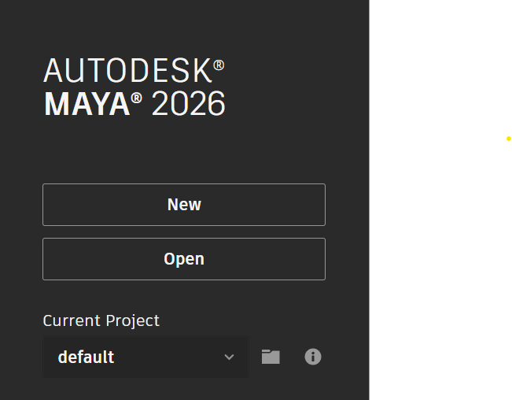
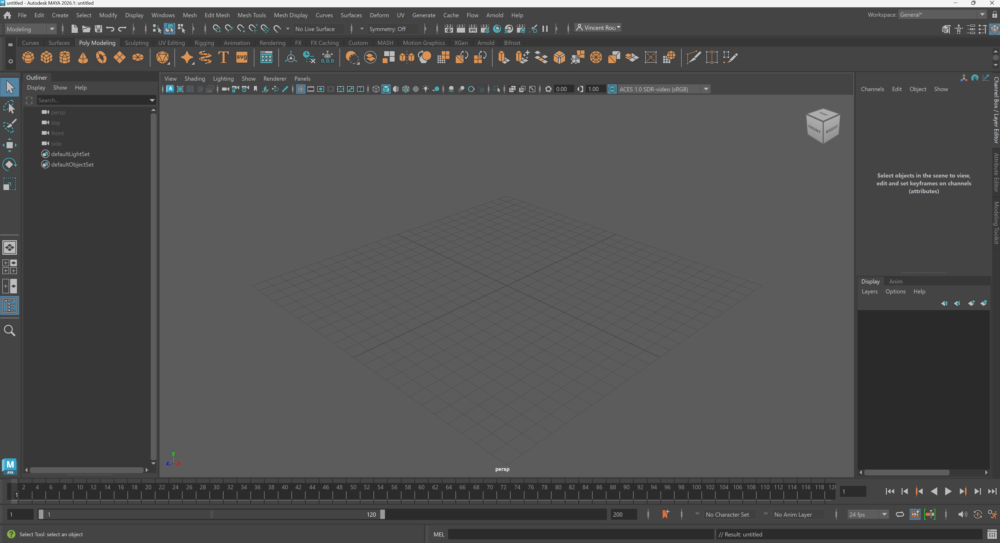
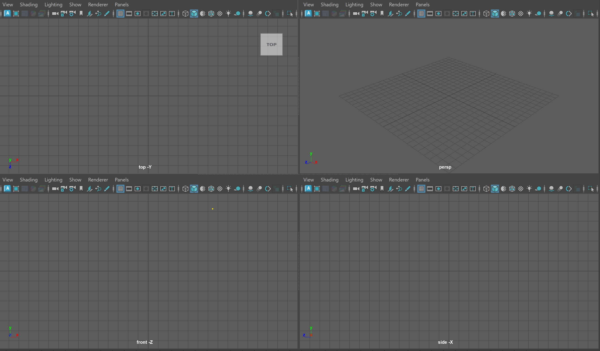
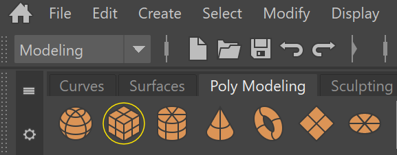
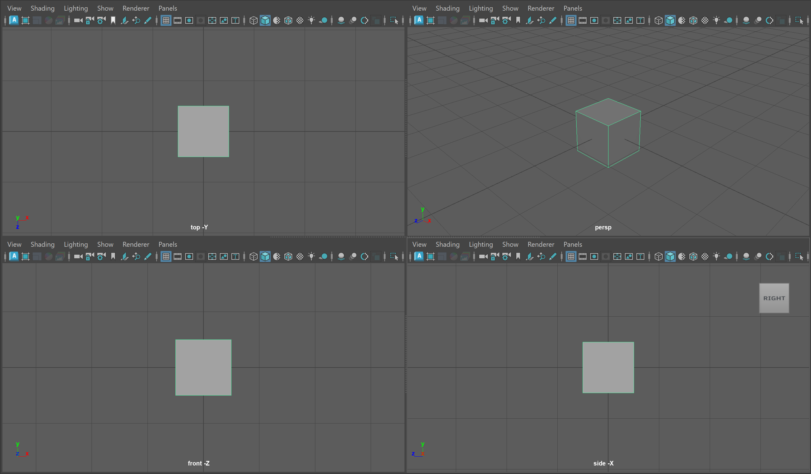
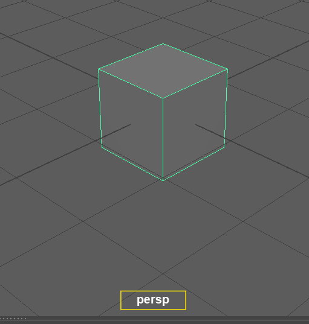
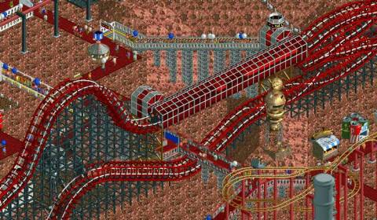

# Maya Interface & Object Creation

## Getting Started  

Let's start by opening Autodesk Maya 2025 or 2026 on the lab computers. You can navigate to the search menu on the bottom of your screen and search for "Maya." <figure> <figcaption> Maya Loading Screen </figcaption></figure>  

This will open you to the Maya homepage where we can create a new project by pressing new.  <figure>  </figure>

You might notice that we need to keep tabbing back and forth between our tutorial and our Maya interface. Since in the lab we are only using one monitor, lets use Windows default split screen feature to create a divided screen. 

Click on top bar of your Maya interface and hold the **Windows Key** and then tap the **Left Arrow Key.** Release the **Windows Key** and you should then see the option to click our **Browser** to have the two screens side by side.

By click and dragging on the dividing line between the two screens you can change the amount of your screen each window takes up. This class website has flexible scaling so feel free to make the **browser** as small as you like.

We'll be using this technique for the remainder of this class so refer back to this section if you forget the order of operations.

## Maya Interface
<figure> <figcaption> My Maya interface</figcaption> </figure> 

Although the Maya interface seems very confusing at first, as we move through the course you will notice that your navigation of buttons and menus will become more intuitive. Our readings for this introductory module will introduce software studies through an examination of Maya's interface.

To keep things simple, we will cover parts of the interface as needed for different parts of the course. As a continuous reminder, as an experimental arts course we are not looking for technical *mastery*, we are looking to understand Maya/3D software in general artistically and critically.

## View Panel

In the center of our screen we have our [view panel](https://help.autodesk.com/view/MAYAUL/2025/ENU/?guid=GUID-455539A6-3506-458C-92DA-14F171C14553). This is where we can view 3D objects and manipulate them in real time.

> `Although we are just starting, begin to consider the relationship between the view panel, which shows a live 3D view, and the various data points around this central portion. How is a 3D model both represented as a real-time image and data?`

_You might see four view panels as shown below:_

<figure> <figcaption> Four view panels</figcaption> </figure>

If you do not see four panels, hover over your main panel and tap the *space* key.

Each of these view panels represents a different way of viewing our model.

To make things easier, lets create a basic 3D model (called a [polygon primitive](https://help.autodesk.com/view/MAYAUL/2025/ENU/?guid=GUID-45D2EAD4-5BCF-42DA-A1AB-EC6EE09FE705)) to see how an object appears in each view port.

Click on the icon of the cube within the Poly Modeling [Shelf](https://help.autodesk.com/view/MAYAUL/2025/ENU/?guid=GUID-4A21F741-C9AC-4AE5-897E-B6F8C68ADF90) located in the upper right corner of your screen.

<figure> </figure>

In the center of our screen, we should now see our cube four, each time from a slightly different perspective. Each of these view ports represents a different way of viewing our model.

<figure> <figcaption> Four view with Cube (I have zoomed in on the cube slightly)</figcaption></figure>

We can infer what each of these view panels are displaying based on the name at the bottom of each quadrant. The image below shows the name of the perspective view port (persp). While the other view panels show the cube from the top, front and side position using orthographic projection. We'll learn a bit more about the technology of *projection* later on in the course but what we need to know for now is that these view panels are showing the two-dimensional representation of a three-dimensional object.

<figure></figure>
- Perspective Projection: a method for projecting a 3D object onto a 2D picture plane to approximate how a 3D object might be viewed by a camera IRL.

- Orthographic Projection: a method for projecting an 3D object to make all lines parallel. You might think for now of isometric projection used in many video games.

<figure></figure>

Orthographic Projection in Roller Coaster Tycoon 2 (original resolution) - [Giant Bomb](https://www.giantbomb.com/rollercoaster-tycoon-2/3030-11178/)

