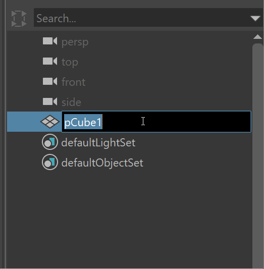
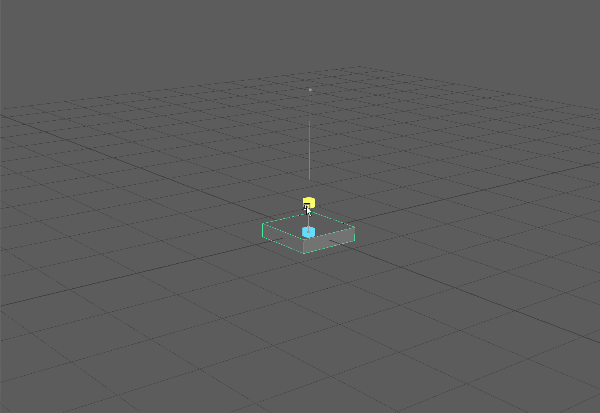
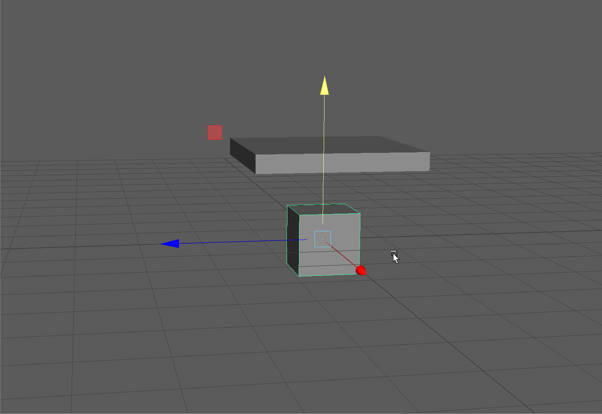
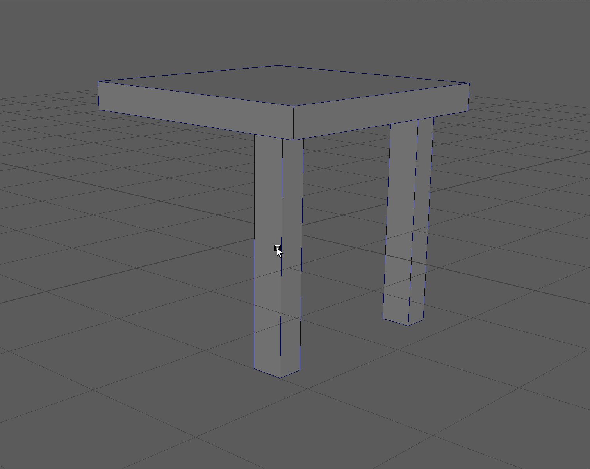
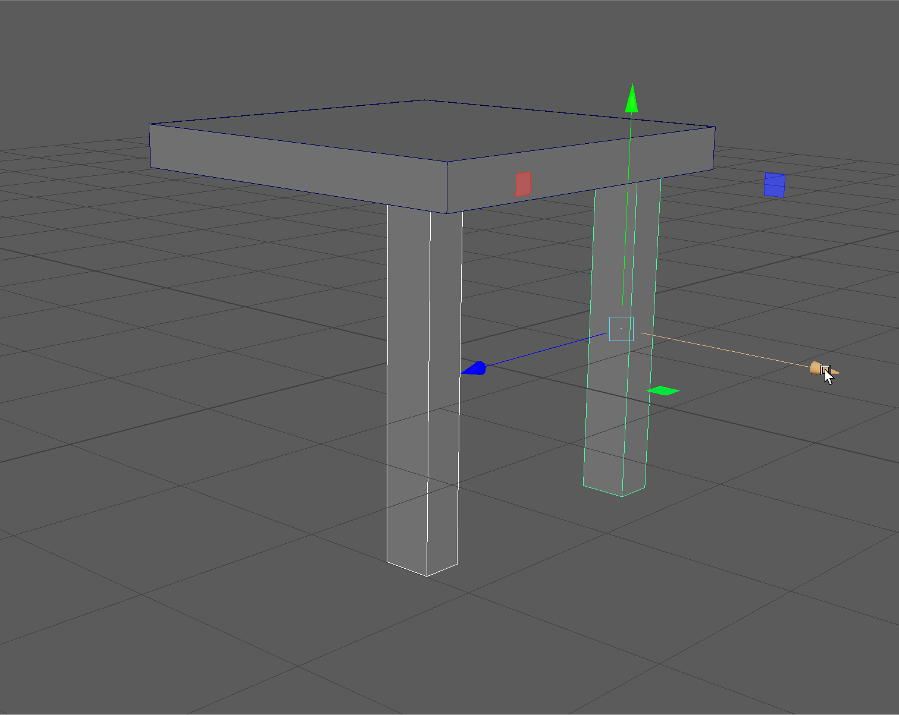
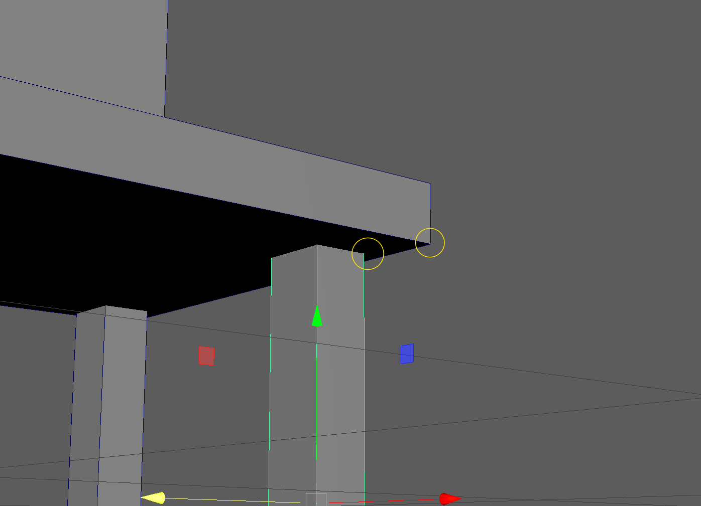
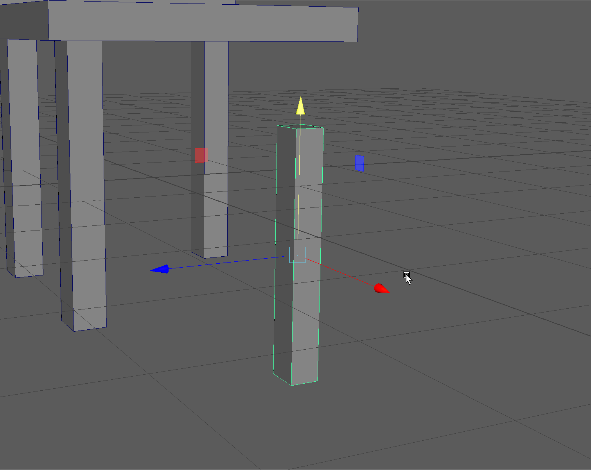
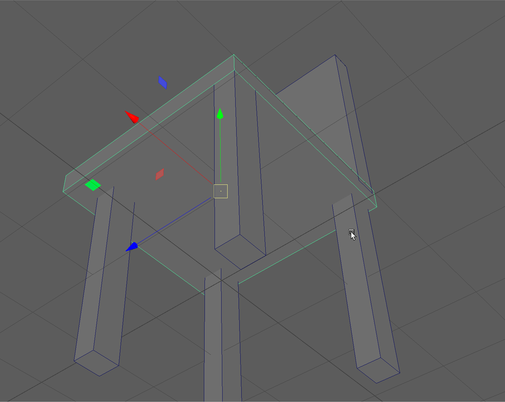

# Maya Interface & Object Creation

## Getting Started  

Let's start by opening Autodesk Maya 2025 or 2026 on the lab computers. You can navigate to the search menu on the bottom of your screen and search for "Maya." <figure> <figcaption> Maya Loading Screen </figcaption></figure>  

This will open you to the Maya homepage where we can create a new project by pressing new.  <figure>  </figure>

You might notice that we need to keep tabbing back and forth between our tutorial and our Maya interface. Since in the lab we are only using one monitor, lets use Windows default split screen feature to create a divided screen. 

Click on top bar of your Maya interface and hold the **Windows Key** and then tap the **Left Arrow Key.** Release the **Windows Key** and you should then see the option to click our **Browser** to have the two screens side by side.

By click and dragging on the dividing line between the two screens you can change the amount of your screen each window takes up. This class website has flexible scaling so feel free to make the **browser** as small as you like.

We'll be using this technique for the remainder of this class so refer back to this section if you forget the order of operations.

## Maya Interface
<figure> <figcaption> My Maya interface</figcaption> </figure> 

Although the Maya interface seems very confusing at first, as we move through the course you will notice that your navigation of buttons and menus will become more intuitive. Our readings for this introductory module will introduce software studies through an examination of Maya's interface.

To keep things simple, we will cover parts of the interface as needed for different parts of the course. As a continuous reminder, as an experimental arts course we are not looking for technical *mastery*, we are looking to understand Maya/3D software in general artistically and critically.
___

## View Panel

In the center of our screen we have our [view panel](https://help.autodesk.com/view/MAYAUL/2025/ENU/?guid=GUID-455539A6-3506-458C-92DA-14F171C14553). This is where we can view 3D objects and manipulate them in real time.

> `Thought:` Although we are just starting, begin to consider the relationship between the view panel, which shows a live 3D view, and the various data points around this central portion. How is a 3D model both represented as a real-time image and data?

_You might see four view panels as shown below:_

<figure> <figcaption> Four view panels</figcaption> </figure>

If you do not see four panels, hover over your main panel and tap the *space* key.

Each of these view panels represents a different way of viewing our model.

To make things easier, lets create a basic 3D model (called a [polygon primitive](https://help.autodesk.com/view/MAYAUL/2025/ENU/?guid=GUID-45D2EAD4-5BCF-42DA-A1AB-EC6EE09FE705)) to see how an object appears in each view port.

Click on the icon of the cube within the Poly Modeling [Shelf](https://help.autodesk.com/view/MAYAUL/2025/ENU/?guid=GUID-4A21F741-C9AC-4AE5-897E-B6F8C68ADF90) located in the upper right corner of your screen.

<figure> </figure>

In the center of our screen, we should now see our cube four, each time from a slightly different perspective. Each of these view ports represents a different way of viewing our model.

<figure> <figcaption> Four view panels with Cube (I have zoomed in on the cube slightly)</figcaption></figure>

We can infer what each of these view panels are displaying based on the name at the bottom of each quadrant. The image below shows the name of the perspective view port (persp). While the other view panels show the cube from the top, front and side position using orthographic projection. We'll learn a bit more about the technology of *projection* later on in the course but what we need to know for now is that these view panels are showing the two-dimensional representation of a three-dimensional object.

<figure></figure>
- Perspective Projection: a method for projecting a 3D object onto a 2D picture plane to approximate how a 3D object might be viewed by a camera IRL.

- Orthographic Projection: a method for projecting an 3D object to make all lines parallel. You might think for now of *isometric* projection used in many video games or architectural drawings.

<figure><figcaption> Isometric Projection in Roller Coaster Tycoon 2 - Image: <a href="https://www.giantbomb.com/rollercoaster-tycoon-2/3030-11178/">Giant Bomb</a></figcaption></figure>

Now that we have a slight understanding of what we are looking at in our view panel, let's begin to dive into the relationship between our object and our scene.
___

## Cartesian Coordinate Space

You might remember from your math classes learning about unit space, or what is more formally known as Cartesian Coordinate space (named after René Descartes). This is a simple coordinate system where, generally, each whole number is marked in a grid structure. You can see a simple example below with some points marked using the common (x,y) notation with x being the horizontal axis and y being the vertical axis.

The important thing to know here is that Maya, and all 3D programs, make use of this coordinate space to visualize the location of models within our scene. The only difference from the image above is that instead of making use of a 2D x,y space, in Maya we use a 3D (x,y,z) space.

In our Maya interface, we should see four view panels. Let's hover over our Perspective view panel and tap the **space key** to maximize this panel.

We should see our cube highlighted with a green outline. If not, we can click on our cube.

Finally, press the **W Key** on your keyboard. We'll talk more shortly about what this hot key does. This should show the Gizmo on our cube.

<figure></figure>

>`UI TIP:` Press the + or - key to change the size of your gizmo

The **Red Arrow** points in the direction of the positive **X Axis**, the **Blue Arrow**, the positive **Z Axis**, and the **Green Arrow**, the positive **Y Axis**.

> `NOTE:` Different 3D software represent the coordinate space differently. While Maya uses the Y Axis to represent the vertical direction, some software use the Z Axis.

What we can infer is that our cube, being in the center of our grid, is at the (0,0,0) position, also known as the origin point. We can see a numerical representation of our object in the coordinate space by looking at our **Channel Box**.
___

## Channel Box

<figure><figcaption> The Channel Box with our Cube selected. Our cube is named pCube1 (the first polygon cube in our scene!)</figcaption></figure>

The Channel Box is UI panel that allows us to quickly see information about our model. The Channel Box is most commonly used in animation to edit various aspects about our models quickly, but it is also a great descriptor of basic information about our model.

We can notice that our Channel Box is separated into different values:

- **Translate**: The position of our object.

- **Rotate**: The rotation of our object.

- **Scale**: The size of our object.

- **Visibility**: Whether or not our object is visible in the scene (we'll touch on this later in the course.)

To start, try inputting some values into of of the **Translate** Channels to see how it affects our Cube.

> `UI TIP:` If you click on a channel such as **TranslateX** and see it highlight, you can **click and drag** your **middle mouse key** to smoothly change the values of the channel.

Notice how changing the channel values of **Translate** directly affects the position of our object within our scene.

Now let's try the opposite. Make sure you can still see the translate gizmo on your cube by clicking on your cube and pressing the **W Key**. Then, **click and drag** on one of the arrows to translate your cube in the view panel. Notice how the corresponding channel values change as you translate your cube.<figure><figcaption> Translating our Cube</figcaption></figure>

> `UI TIP:` If you **click and drag** on the plane between two axis, this will move your object along two axes simultaneously. Also notice that our last click axis is highlighted yellow. <figure><figcaption>By clicking on this highlighted plane, we can move our object along multiple axes</figcaption></figure>

Now, that we have moved our object around a bit, we might notice that it is hard to see how our object is exactly moving from our single viewing perspective.

Let's return our Cube to the origin point by entering in **0** for **Translate X,Y, and Z** in our channel box and begin to discuss view panel navigation.
___

## Navigating around our View Panels

One of the most important UI interactions with Maya in navigating around the 3D space of our perspective view panel. Luckily, view port navigation in Maya is quite simple and only uses our **Alt Key** and **Mouse Buttons**.

### ZOOM (Alt + RMB):
First, let's try zooming into our cube. Hold the **Alt Key** and **Right Mouse Button** and begin dragging in the vertical or horizontal direction. You will notice that dragging on the positive Y and positive X zoom us out, while dragging on the negative Y and negative X zoom us in. <figure><figcaption> Zooming In and Out</figcaption></figure>

### ROTATE (Alt + LMB):
Next, let's try rotating around our cube. Hold the **Alt Key** and **Left Mouse Button** and begin dragging in the vertical or horizontal direction. Notice the different behaviors between dragging vertically and horizontally.<figure><figcaption> Rotating around our Cube </figcaption> </figure>

### PAN (Alt + MMB):
Lastly, let's try panning around our scene. Hold the **Alt Key** and **Middle Mouse Button** and begin dragging in the vertical or horizontal direction. Panning allows us to focus on different parts of our scene.<figure><figcaption>Panning around our Scene</figcaption> </figure>

> `UI TIP:` If you loose track of your object in your scene or if you want to focus on a particular object, you can click on any give object and press the **F Key** to *focus* on that object.

>When you focus on an object and then rotate your camera, you will notice that the camera will rotate around the particular focused object.

> `NOTE:` What is actually happening behind the scenes when we pan, rotate and zoom, is that we are moving a camera called "persp" (from which our View Panel gets its name) changing the properties of this camera. You can click on this camera in the left side of your screen in the **Outliner** (which we will cover shortly) and edit properties such as the Focal Length of your persp camera in the Channel Box.<figure><figcaption>persp camera made visible!</figcaption> </figure>

> `NOTE:` In our orthographic view panels, we are only able to pan and zoom.
___
## Essential Object Manipulation

Now that we know the relationship between our object, the coordinate system and the channel box, as well as how to navigate around our view port, we can now discuss basic object manipulation using **Translate**, **Rotate** and **Scale**.

### Translate (W):

We have already covered a bit about translate, but now lets go in a bit deeper to learn what this tool actually does.

If we click on our cube and again press the **W Key** we can notice that one of the menus on the left highlights. <figure><figcaption>Tool bar showing our Selection, Translate, Rotate and Scale Tools</figcaption> </figure>

Although we can click on this button on the left, it is best practice to begin memorizing essential Maya hot keys.

Try translating using the gizmo while also rotating and panning your camera.
<figure> </figure>

### Rotation (E):

We can also rotate objects in our scene by pressing the **E Key** on our keyboard to bring up our rotation gizmo. By click and dragging on a particular axis, we can rotate our object.

Notice in our Channel Box we are rotating our object in terms of *Degrees*. If we enter 45 in RotateY in our channel box, our cube with turn 45 Degrees around its Y Axis.

<figure> </figure>

> `UI TIP:` By pressing and holding the **J Key** before rotating, we can precisely rotate our object by 15 Degree increments.

### Scale (R):

Lastly, we have scale. This allows us to change the size of our object. Lets reset all our channel box values by entering zero for all translate and rotate channels.

> `UI TIP:` If you want to change the value of more than one channel in your channel box, you can click and then shift click to select all the values your want to change. Then enter the value you want all the channels to have and press enter. Below, I click on TranslateX then shift click on RotateZ and then enter 0 to reset all channel values. <figure> </figure>

Now we can press the **R Key** to bring up our scale tool. We can notice in our Channel Box, the scale values by default are equal to 1. This value works as a multiplier. For example, a scale value of 2 will be twice our original scale.

> `UI TIP:` Notice that the Move, Rotate and Scale tool are all next to each other on your keyboard. Allowing easy access between the tools using W, E, and R.

> `NOTE:` By default Maya uses centimeters for its unit of measurement. Thus, our cube is currently 1cm by 1cm by 1cm. By changing a scale channel value to 2, our object would then be 2 cm on the particular axis. Our grid coordinate by default also uses centimeters.

We can scale our object uniformly by **clicking and dragging** on the **yellow cube** in the center of our scale gizmo. Notice all all Scale Channel values change by the same amount. <figure> </figure>

We can also scale our object on each axis by clicking and dragging on an axis of the scale gizmo.<figure> </figure>

> `UI TIP:` If we don't want to see our Move, Rotate, and Scale gizmos, we can press the **Q Key** on our keyboard to change to our selection tool (also right next to our Move, Rotate, and Scale tools on our keyboard).<figure> </figure>
___

## Outliner

Before we move onto playing around with making some basic models using objects, let's talk about how we can keep track of objects within our scene.

First, let's clean up our scene by deleting our original cube.

Click on your Cube and then press the **Delete Key** on your keyboard.

Then lets add in a new cube using the **Poly Modeling Shelf**.<figure> </figure>

Notice that when we add in the cube a new object appears in our Outliner on the left side of our screen.<figure> </figure>

The Outliner lists all of our objects within our scene. Notice we have all of our cameras as well as our newly created "pCube1".

We can also rename our objects within our Outliner by double click on the name of our object. Lets rename our cube to "Base"
<figure> </figure>

The Outliner can be used for finding objects within our scene as well as selecting objects by clicking on them.

## Modeling a Basic Chair

Although we are not really diving into the complexities of model today, let's use what we have learned in class so far to build a basic chair.

1. Scale and Move the base object of your chair to become a seat.<figure> </figure>
2. Let's create a new cube using our **Poly Modeling Shelf** and name it "Leg" within our Outliner.
3. Scale and move your new cube to be in the position of a chair leg.<figure> </figure>
4. We can now duplicate this leg. We can do this by clicking on our leg, activating the Translate tool with the **W Key** and then holding **Shift** and dragging on an axis.
5. You might now notice it is hard to see the edges of your different objects. In our view panel, we can display the edges of our model. This is the "wire frame on shaded" view mode.
6. Now let's use another method of duplication or cloning for our legs. **Click** and then **Shift+Click** on the other leg. 
7. Then press **Ctrl+D** on your keyboard to duplicate the two models and drag them over to the correct position.
8. Finally, lets click on our base, press **Ctrl+D** to duplicate it. Than Rotate it while holding the **J Key** to snap it 90 Degrees before moving it to the back of our chair.
___

## Pivot Points and Snapping

Now that we have made our chair you might notice that things are looking a bit wonky! This is okay, 3D models don't always need to be precise. However, since our focus today is on learning the basics before we break them, lets get a bit more precise with how we are moving our objects in our scene.

To do this, we will make use of the **pivot point** and **snapping**.

If we click on one of the legs our our chair and activate our Translate tool, well notice that the pivot point of this object is in the very center. The pivot point is the position where our object translates, rotates and scales. By moving this pivot point we can change how our object behaves.<figure><figcaption>Pivot point at the center of the chair's leg</figcaption></figure>

Our goal is to change our pivot point in such a way that we can align the corner of our chair leg with the corner of our chair base. <figure><figcaption>The Two corners we want to align</figcaption></figure>

To do this, we'll need to move our pivot point to be on the correct corner of our leg, then align that to be at the corner of the base of our chair.

### Moving Our Pivot and Snapping

1. Let's move our chair leg down to make some more space. 
2. Press the **D Key** on your keyboard to bring up our pivot controls.
3. To snap our pivot to the corner of our leg we can hold down on the **V Key** on our keyboard (short for vertex, which will get to next class). And click and drag on the yellow center of our pivot to move it to the proper corner.
4. We can turn off the pivot tool using the **D Key**, make sure our Translate tool is on and press and hold the **V Key** again to snap our object to the bottom corner of our base by clicking and dragging on the center of our Translate gizmo.
5. Finally, let's repeat these steps with the other parts of our chair.

