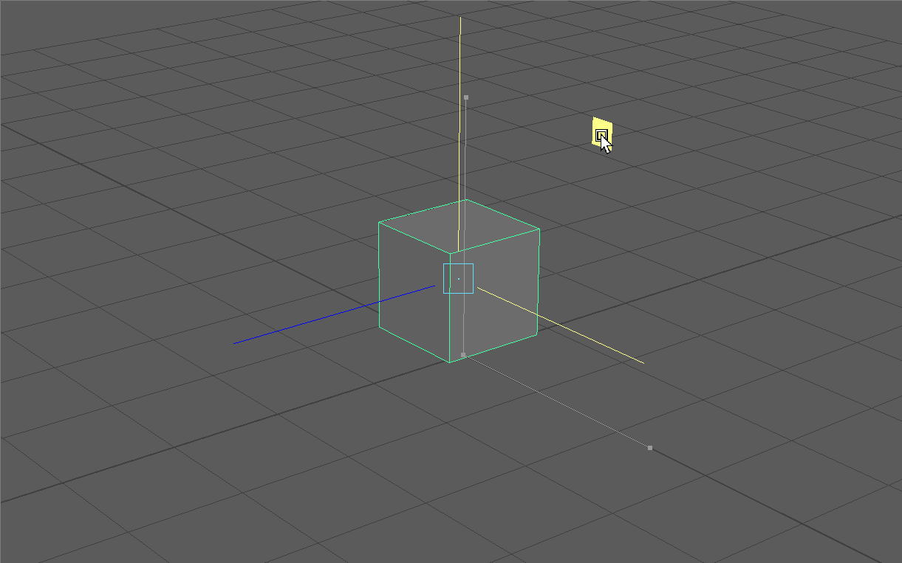
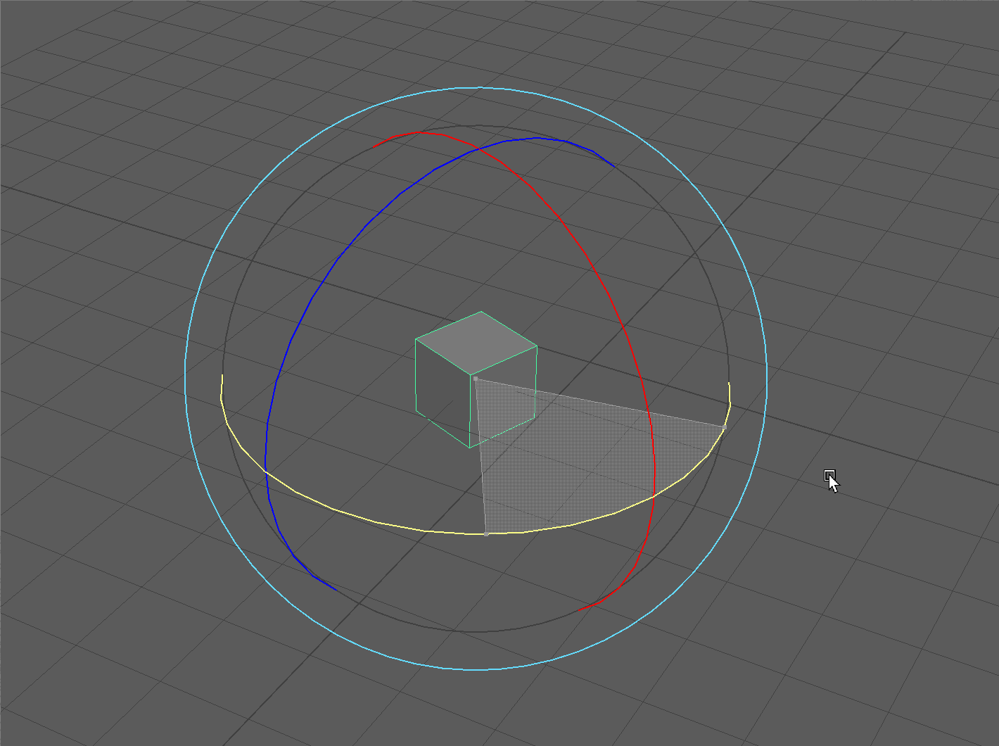
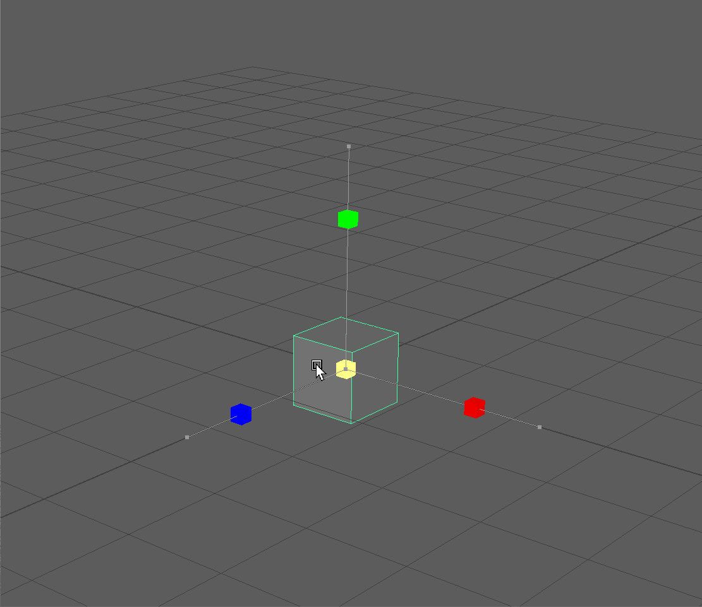
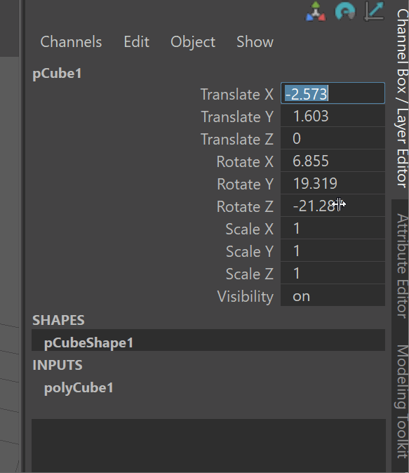
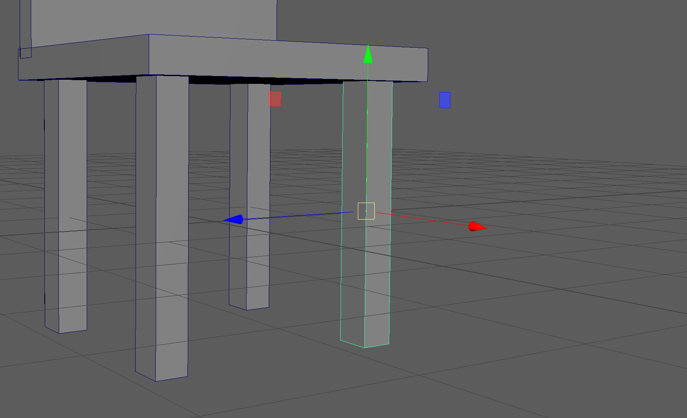

# Maya Interface & Object Creation

## Getting Started  

Opening Maya will bring you to the Maya homepage. You can create a new scene by pressing new.  <figure>  </figure>

## Maya Interface
<figure> <figcaption> My Maya interface</figcaption> </figure> 

Although the Maya interface seems very confusing at first, as we move through the course, you will notice that your navigation of buttons and menus will become more intuitive. Our readings for this introductory module will introduce software studies through an examination of Maya's interface.

To keep things simple, we will cover parts of the interface as needed for different parts of the course. As a continuous reminder, as an experimental arts course, we are not looking for technical *mastery*, we are looking to understand Maya/3D software in general artistically and critically.

## Polygon Primitives

Polygon primitives are basic 3D shapes that we can use to build our models.
The most important polygon primitives are **cube**, **cylinder**. and **plane**.

<figure></figure>

## Poly Modeling Shelf

We can make basics objects, called [polygon primitive](https://help.autodesk.com/view/MAYAUL/2025/ENU/?guid=GUID-45D2EAD4-5BCF-42DA-A1AB-EC6EE09FE705) by using the **Poly Modeling [Shelf.](https://help.autodesk.com/view/MAYAUL/2025/ENU/?guid=GUID-4A21F741-C9AC-4AE5-897E-B6F8C68ADF90)** The **Poly Modeling Shelf** is located in the upper left corner of your UI. 

<figure> </figure>

## View Panel

[Reference](https://help.autodesk.com/view/MAYAUL/2025/ENU/?guid=GUID-455539A6-3506-458C-92DA-14F171C14553)

In the center of our screen, we have our view panel. This is where we can view 3D objects and manipulate them in real time.

_You might see four view panels as shown below:_

<figure> <figcaption> Four view panels</figcaption> </figure>

If you do not see four panels, hover over your main panel and tap the *space* key. This will switch to 4 views.

Each of these view panels represents a different way of viewing our model.

<figure> <figcaption> Four view panels with Cube</figcaption></figure>

The image below shows the name of the **perspective** view port (persp). While the other view panels show the cube from the **top**, **front** and **side** position using orthographic projection. 

<figure></figure>
- Perspective Projection: a method for projecting a 3D object onto a 2D picture plane to approximate how a 3D object might be viewed by a camera IRL.

- Orthographic Projection: a method for projecting an 3D object to make all lines parallel. You might think for now of *isometric* projection used in many video games or architectural drawings.

<figure><figcaption> Isometric Projection in Roller Coaster Tycoon 2 - Image: <a href="https://www.giantbomb.com/rollercoaster-tycoon-2/3030-11178/">Giant Bomb</a></figcaption></figure>

## Selection

We can activate the Selection Tool using the **Q** on our keyboard.

### Single Objects

We can select an object by using the **Left Mouse Button (LMB)**

To deselect an object, we can click in an open space in our view panel.

### Multiple Objects

To select multiple objects, we can use **Shift+Left Mouse Button**

To deselect an object from our multi-selection, use **Ctrl+Left Mouse Button**

### Box Selection

Click and drag in your view port to create a selection box. The selection box works with the above hot keys.

### Select All

Use **Ctrl + Shift + A** to select all the models in your scene.

### Invert Selection

Use **Ctrl+Shift+I** to invert your selection

## Cartesian Coordinate Space

You might remember from your math classes learning about unit space, or what is more formally known as Cartesian Coordinate space (named after René Descartes). This is a simple coordinate system where, generally, each whole number is marked in a grid structure. You can see a simple example below with some points marked using the common (x,y) notation with x being the horizontal axis and y being the vertical axis.

The important thing to know here is that Maya, and all 3D programs, make use of this coordinate space to visualize the location of models within our scene. The only difference from the image above is that instead of making use of a 2D x,y space, in Maya we use a 3D (x,y,z) space.

<figure></figure>

>`UI TIP:` Press the + or - key to change the size of your gizmo

The **Red Arrow** points in the direction of the positive **X Axis**, the **Blue Arrow**, the positive **Z Axis**, and the **Green Arrow**, the positive **Y Axis**.

> `NOTE:` Different 3D software represent the coordinate space differently. While Maya uses the Y Axis to represent the vertical direction, some software use the Z Axis.

What we can infer is that this cube, being in the center of the grid, is at the (0,0,0) position, also known as the origin point.

### ZOOM (Alt + RMB):
First, let's try zooming into our cube. Hold the **Alt Key** and **Right Mouse Button** and begin dragging in the vertical or horizontal direction. You will notice that dragging on the positive Y and positive X zoom us out, while dragging on the negative Y and negative X zoom us in. <figure><figcaption> Zooming In and Out</figcaption></figure>

### ROTATE (Alt + LMB):
Next, let's try rotating around our cube. Hold the **Alt Key** and **Left Mouse Button** and begin dragging in the vertical or horizontal direction. Notice the different behaviors between dragging vertically and horizontally.<figure><figcaption> Rotating around our Cube </figcaption> </figure>

### PAN (Alt + MMB):
To pan, hold the **Alt Key** and **Middle Mouse Button** and begin dragging in the vertical or horizontal direction. Panning allows us to focus on different parts of our scene.<figure><figcaption>Panning around our Scene</figcaption> </figure>

## Focus

> `UI TIP:` If you loose track of your object in your scene or if you want to focus on a particular object, you can click on any give object and press the **F Key** to *focus* on that object.

>When you focus on an object and then rotate your camera, you will notice that the camera will rotate around the particular focused object.

## Camera

> `NOTE:` What is actually happening behind the scenes when we pan, rotate and zoom, is that we are moving a camera called "persp" (from which our View Panel gets its name) changing the properties of this camera. You can click on this camera in the left side of your screen in the **Outliner** (which we will cover shortly) and edit properties such as the Focal Length of your persp camera in the Channel Box.<figure><figcaption>persp camera made visible!</figcaption> </figure>

> `NOTE:` In our orthographic view panels, we are only able to pan and zoom.

## Move (W):

Use the **W Key** to activate the move tool. We can notice that one of the menus on the left highlights. <figure><figcaption>Tool bar showing our Selection, Move, Rotate and Scale Tools</figcaption> </figure>

Although we can click on this button on the left, it is best practice to begin memorizing essential Maya hot keys.

We can move a model by click and dragging on an axis in the move gizmo.

<figure> </figure>

> `UI TIP:` If you **click and drag** on the plane between two axis, this will move your object along two axes simultaneously. Also notice that our last click axis is highlighted yellow. <figure><figcaption>By clicking on this highlighted plane, we can move our object along multiple axes</figcaption></figure>

## Rotation (E):

We can also rotate objects in our scene by pressing the **E Key** on our keyboard to bring up our rotation gizmo. By click and dragging on a particular axis, we can rotate our object.

Notice in our Channel Box we are rotating our object in terms of *Degrees*. If we enter 45 in RotateY in our channel box, our cube with turn 45 Degrees around its Y Axis.

<figure> </figure>

>`UI TIP:` By pressing and holding the **J Key** before rotating, we can precisely rotate our object by 15 Degree increments.

>`UI TIP:` We can rotate our model based on the camera view by using the large circle around the axes of our rotate gizmo.

## Scale (R):

We can change the size our object with the scale tool. The **R Key** to bring up our scale tool.

We can notice in our Channel Box, the scale values by default are equal to 1. This value works as a multiplier. For example, a scale value of 2 will be twice our original scale.

> `NOTE:` By default Maya uses centimeters for its unit of measurement. Thus, our cube is currently 1cm by 1cm by 1cm. By changing a scale channel value to 2, our object would then be 2 cm on the particular axis. Our grid coordinate by default also uses centimeters.

We can scale our object uniformly by **clicking and dragging** on the **yellow cube** in the center of our scale gizmo. Notice all all Scale Channel values change by the same amount. <figure> </figure>

We can also scale our object on each axis by clicking and dragging on an axis of the scale gizmo.<figure> </figure>

## Channel Box

[Reference](https://help.autodesk.com/view/MAYAUL/2024/ENU/?guid=GUID-4C954FB2-8B6A-4BBD-9695-DF432616D0D2)

<figure><figcaption> The Channel Box with a cube selected.</figcaption></figure>

The Channel Box is UI panel that allows us to quickly see information about our model. The Channel Box is most commonly used in animation to edit various aspects about our models quickly, but it is also a great descriptor of basic information about our model.

We can notice that our Channel Box is separated into different values:

- **Translate**: The position of our object.

- **Rotate**: The rotation of our object.

- **Scale**: The size of our object.

- **Visibility**: Whether or not our object is visible in the scene (we'll touch on this later in the course.)

Changing these values directly affects the selected object within the scene.

> `UI TIP:` If you click on a channel such as **TranslateX** and see it highlight, you can **click and drag** your **middle mouse key** to smoothly change the values of the channel.
>
> `UI TIP:` If you want to change the value of more than one channel in your channel box, you can click and then shift click to select all the values your want to change. Then enter the value you want all the channels to have and press enter. Below, I click on TranslateX then shift click on RotateZ and then enter 0 to reset all channel values. <figure> </figure>

## Outliner

The Outliner can be used for getting an overview of our scene. The Outliner is on the left side of our UI and displays all the objects within our scene. 

When we make a new object, it appears the Outliner.
<figure> </figure>

We can also rename our objects within our Outliner by double click on the name of an object. 
<figure> </figure>

## Duplicating Objects

We can copy and paste and object by cloning it, or duplicating it.

You can duplicate a model using any of these options with a model selected:

- Press Ctrl + D.
- Select Edit > Duplicate.
- Shift + drag any transformation manipulator while in Object mode (also known as smart duplicating).

## Pivot Point & Snapping

### Pivot Points 
When we select an object and turn on a gizmo, such as the Move gizmo, the location of this gizmo on our object is our pivot point. This the point around which our object moves, rotates and scales.

By default, the pivot point is at the center of newly created objects.

<figure><figcaption>Pivot point at the center of object</figcaption></figure>

We often want to edit our pivot point so that we might be able to place objects more precisely.

By toggling the **D** key, we can enter and exit the pivot point editing mode. In this mode, we can edit the position and rotation of our pivot point. We can use the gizmo to edit our pivots position.

### Snapping

Snapping is one of the core features of Maya and many 3D applications. By using snapping, we can precisely place objects. Snapping in many is controlled by holding different hot keys:

- `v` - vertex snapping
- `x` - grid snapping
- `c` - edge snapping

Examples:

We can hold the `v` key to snap pivot points:

We can also use all types of snapping to move objects.
Below, the `v` key is used to snap the cube to a corner.

>`UI TIP:` Objects will snap based on their pivot point.

## Save and Auto-save

### Save

To Save your scene, us **ctr+s**, or navigate to file > save.

### To Auto Save:

1. Select Windows > Settings/Preferences > Preferences. The Preferences window appears.
2. In the Categories, under the Settings section, select Files/Projects.
3. In the Autosave section, turn on Enable.
4. Set any additional options and click the Save button. 

