# Subdivision Modeling
> `RECAP:` What we learned last class:

- Aspects of Polygonal Modeling with Maya
- Faces
- Edges
- Vertices
- Space and Transforms
- Combine
- Freeze
- History
- Circularize
- Duplicate components

> `PLAN:`

- What is subdivision modeling and how do we use it to make more complex models?
- How to use Edge Loops to change the shape of subdivided models
- Using subdivision to make a die.
- History of the Utah Teapot
- Using subdivision to model the Utah Teapot

## Practice File

---
Download [Practice File](https://scrippscollege.app.box.com/s/bfml0momr6a558ocr2gdiukk83o43ecf)

---

## Subdivision Basics

<figure> 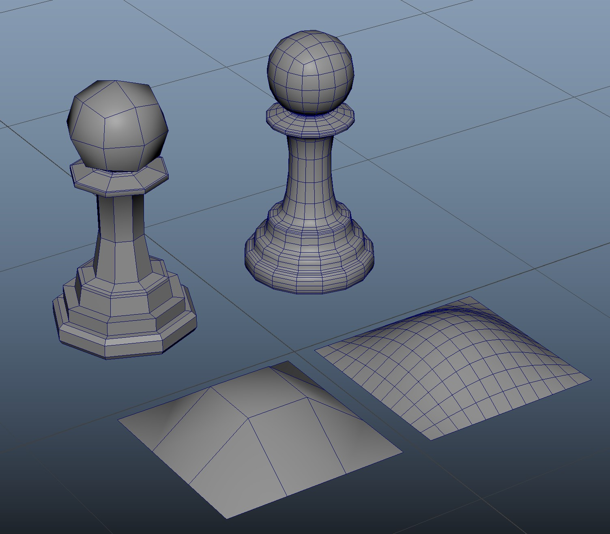<figcaption>Subdivided Models</figcaption></figure>

Subdivision modeling is the process of using lower resolution geometry to create complex objects with clean topology. Subdivision modeling is the most common form of poly modeling, being used in games, animation, visual effects, and art practices.

Subdivision divides each face by four and averages the positions of the new vertices.

<figure> 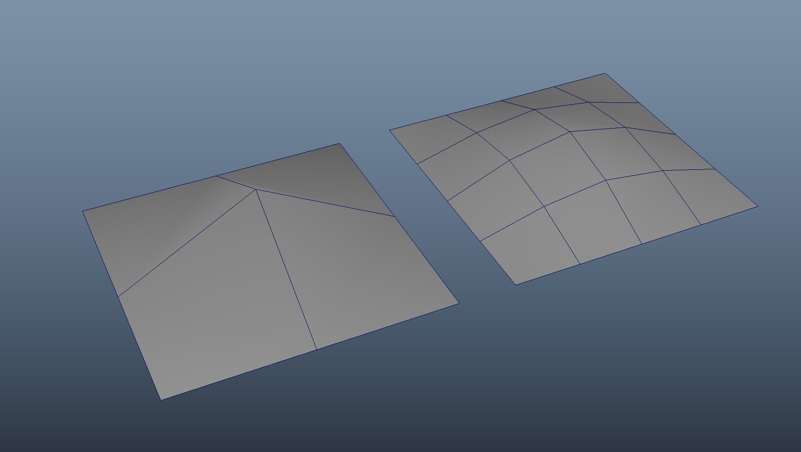<figcaption>Edge loops divided and vertices averaged</figcaption></figure>

There are many different algorithms for subdiving a model. Maya by default uses an adapted version of the Catmull–Clark Subdivision algorithm (more on this in the coming weeks). Other algorithms include OpenSubdiv, developed by Pixar.

## Smooth Preview

We can preview what our mesh will look like subdivided using the **3** Key. This turns on **Smooth Preview**

We can turn off the **Smooth Preview** by pressing the **1** Key.

<figure> 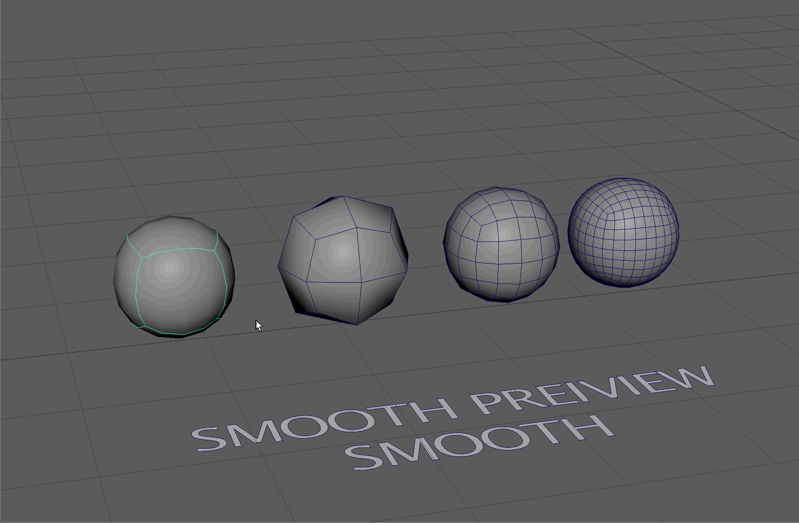<figcaption></figcaption></figure>

The **2** Key will show us our model in smooth preview as well as the **cage** of our original mesh.

You can see the cage as an outline of the edges of your model. This is called the **wireframe**

<figure> 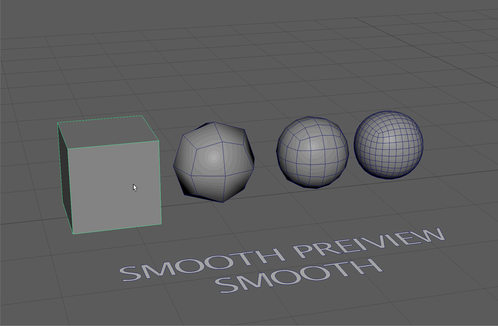<figcaption></figcaption></figure>

`UI TIP:` You can switch between a global wireframe mode by pressing the **4** key. Switch back to **Shaded** mode using the **5** key.

We can also move our geometry in Smooth preview to see the different effects of smoothing.

<figure> 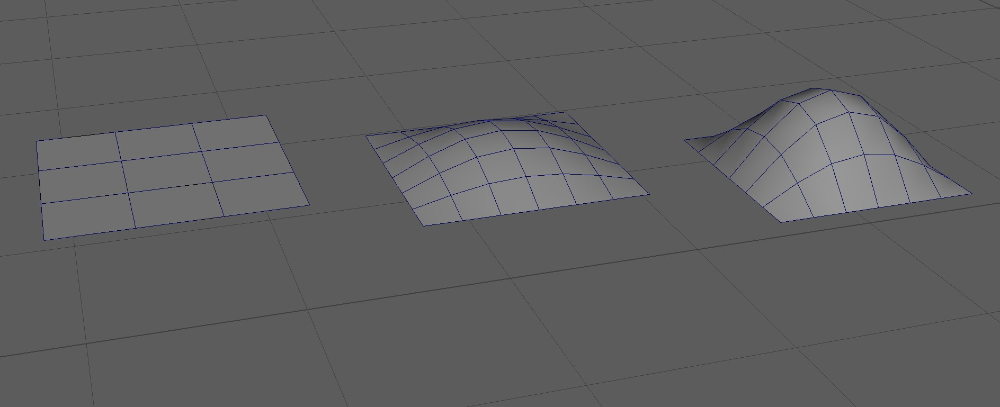<figcaption></figcaption></figure>

## Smooth

To actually change the geometry of our model we can navigate holding **Shift+RMB** to **Smooth**.

This will bring up a dialog box asking us how many divisions we want to make.

<figure> 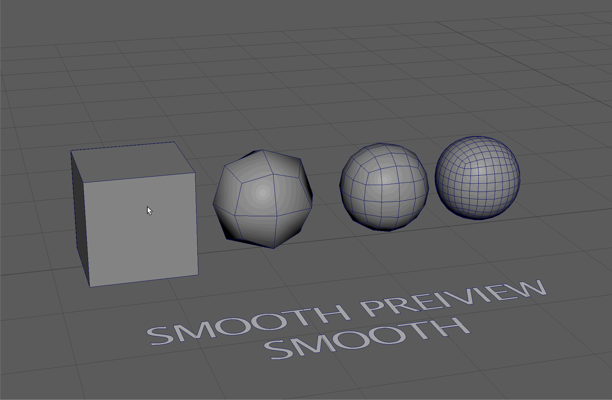<figcaption></figcaption></figure>

We can subdivide our model as many times as we want. However, over dividing our model, and creating a model with too many faces, can cause our Maya scene to run drastically slower or even crash. Subdivision modeling is a balance between getting the right amount of smoothness for our scene, and making sure out computer can still run!

With this in mind, the end result of our model, or how smooth our model should be, depends on its final destination. In an animation, where all rendering is calculated before hand and we only see the final result, a fairly high poly model is okay.

In games, however, where rendering is being calculated in real time, we want our model to be as low resolution as possible while still describing the shape or form that we want to convey.

<figure> 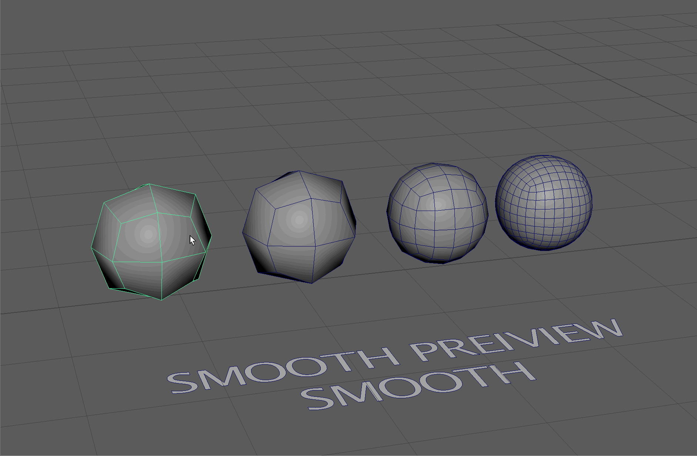<figcaption></figcaption></figure>

### Multi-Cut Tool for Subdivision

We can change the shape of our subdivided model by placing edge loops at specific locations on our model.

Since subdivision divides edge loops and averages the position of vertices, placing edge loops close together will result in less drastic changes in position and the appearance of a harder edge.

The easiest way to add edge loops quickly in Maya is by using the **Multi-cut tool**.

To activate the **Multi-cut tool**, head to object mode and use the **Shift + RMB** menu to navigate to **Multi-cut**.

The **Multi Cut tool** can be used for a variety of different operations.

- Click on your model to cut in new edges (press **Right-Click** to finish a cut)
- Hold the **Ctrl** Key to add in new edge loops
    - **Click** to add and edge loop
    - **Middle Mouse Click** to add the edge loop at the center.

<figure> 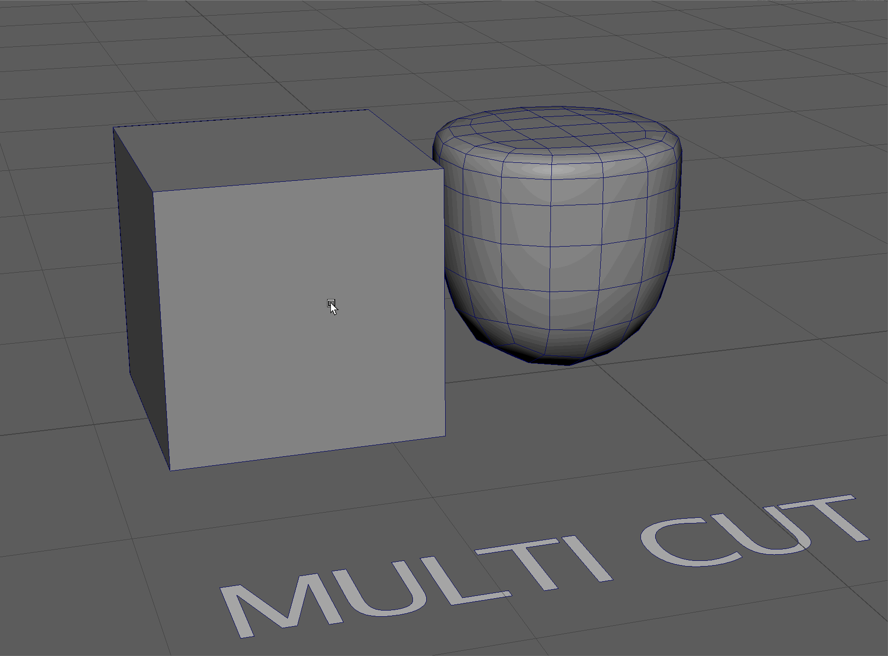<figcaption></figcaption></figure>

When we smooth our model with two levels of subdivision, the top of the model appears to be a harder edge.

<figure> 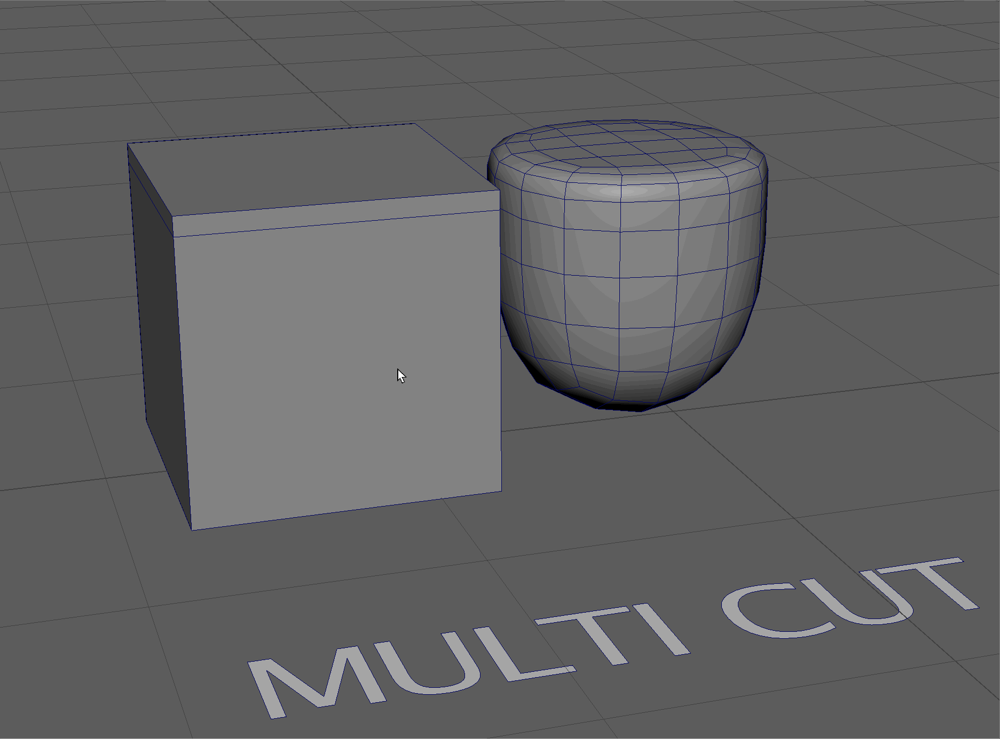<figcaption></figcaption></figure>

### Edges, Smoothing, and Triple Fencing

If we use the multi cut on two sides our model, we get a different result.

<figure> 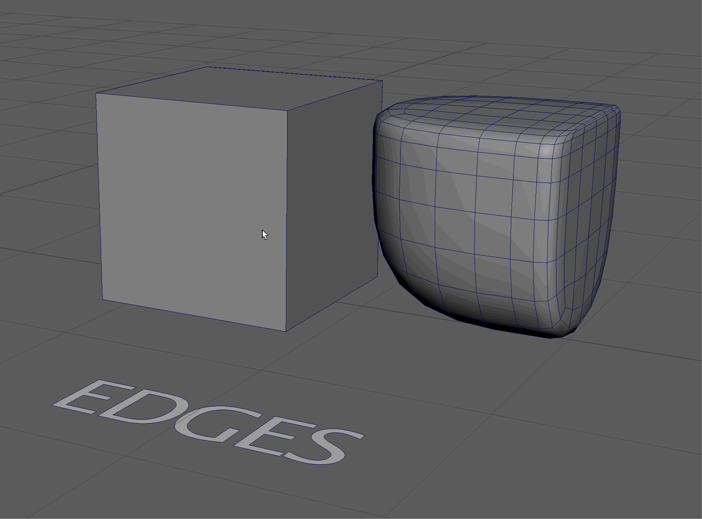<figcaption></figcaption></figure>
<figure> 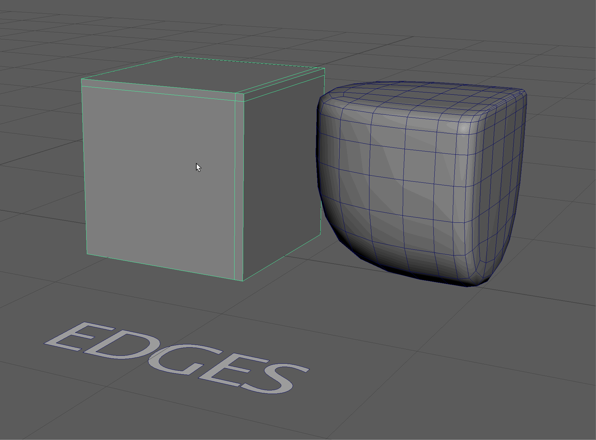<figcaption></figcaption></figure>

We can also use the Multi-cut tool to add two edge loops on either side of an existing edge loop to create hard edges. This is sometimes called **Triple Fencing.**

<figure> 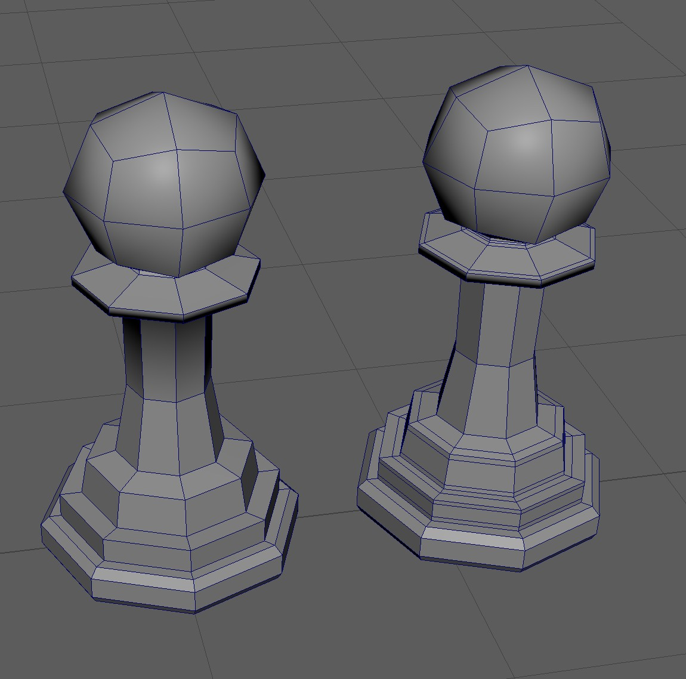<figcaption></figcaption></figure>

### Deleting Faces for Different Results

Having an open face, by deleting a part of our geometry, is a great technique for keeping parts our model undivided as we build out more complex geometry. 

<figure> 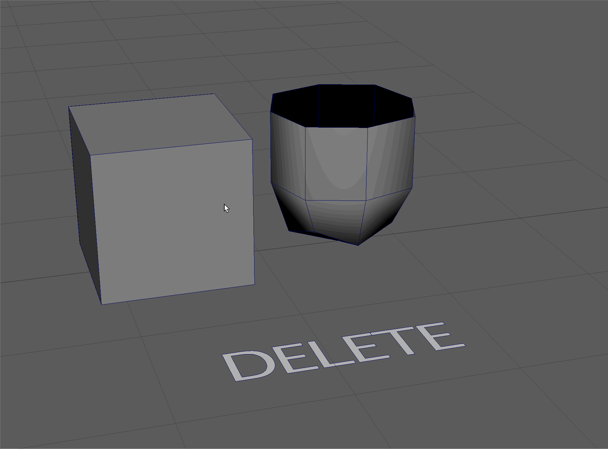<figcaption></figcaption></figure>

## Utah Teapot

[Reference](https://graphics.cs.utah.edu/teapot/)

The Utah teapot was developed by Martin Newell at the University of Utah in 1975. For much of computer graphics history, it was the standard model for testing modeling, lighting, texturing and rendering algorithms.

We'll be reading more about the Utah teapot and understanding its cultural and political impact in chapter 3 of Jacob Gaboury's book *Image Objects.*

<figure> 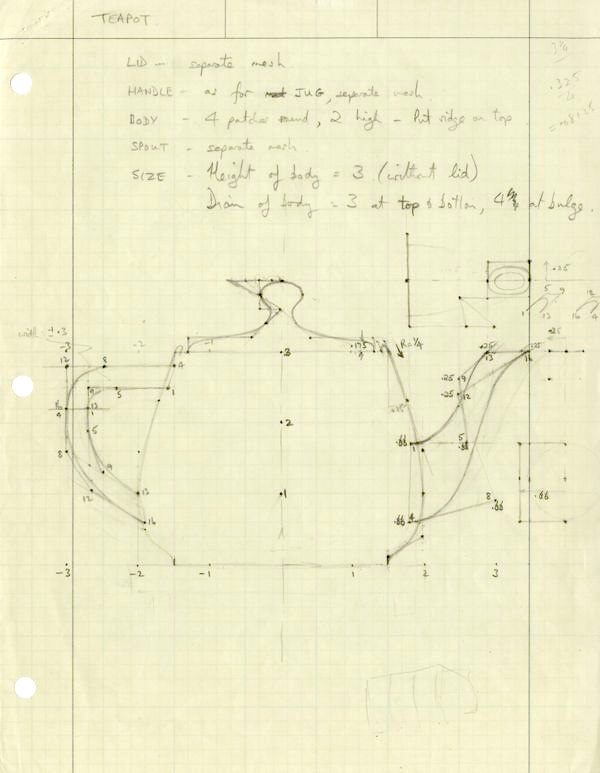<figcaption>
Original drawing of the Utah Teapot by Martin Newell <a href= "https://graphics.cs.utah.edu/teapot/">Link</a>
</figcaption></figure>

 Rendering of the Utah Teapot by <a href="//commons.wikimedia.org/wiki/User:Dhatfield" title="User:Dhatfield">Dhatfield</a> - Own work, <a href="https://creativecommons.org/licenses/by-sa/3.0" title="Creative Commons Attribution-Share Alike 3.0">CC BY-SA 3.0</a>, <a href="https://commons.wikimedia.org/w/index.php?curid=4303243">Link</a>

 The Original Teapot used to make the Utah Teapot Model. Photo by Marshall Astor (<a rel="nofollow" class="external free" href="http://www.marshallastor.com/">http://www.marshallastor.com/</a>) - <a rel="nofollow" class="external free" href="https://www.flickr.com/photo_zoom.gne?id=352811902&amp;size=o">https://www.flickr.com/photo_zoom.gne?id=352811902&amp;size=o</a> (<a rel="nofollow" class="external free" href="https://www.flickr.com/photos/lifeontheedge/352811902/">https://www.flickr.com/photos/lifeontheedge/352811902/</a>), <a href="https://creativecommons.org/licenses/by-sa/2.0" title="Creative Commons Attribution-Share Alike 2.0">CC BY-SA 2.0</a>, <a href="https://commons.wikimedia.org/w/index.php?curid=1743696">Link</a>
