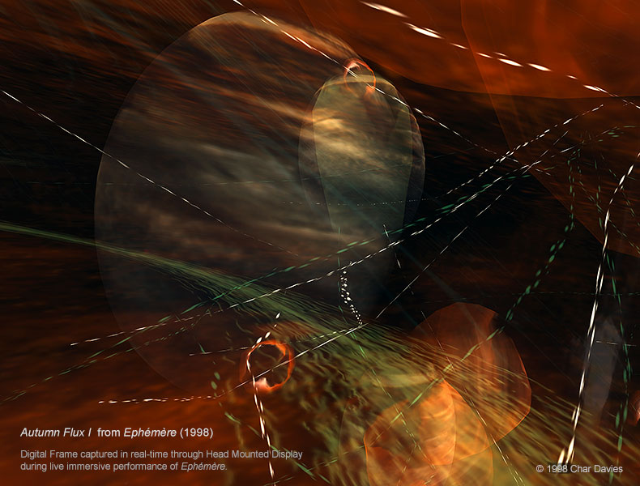
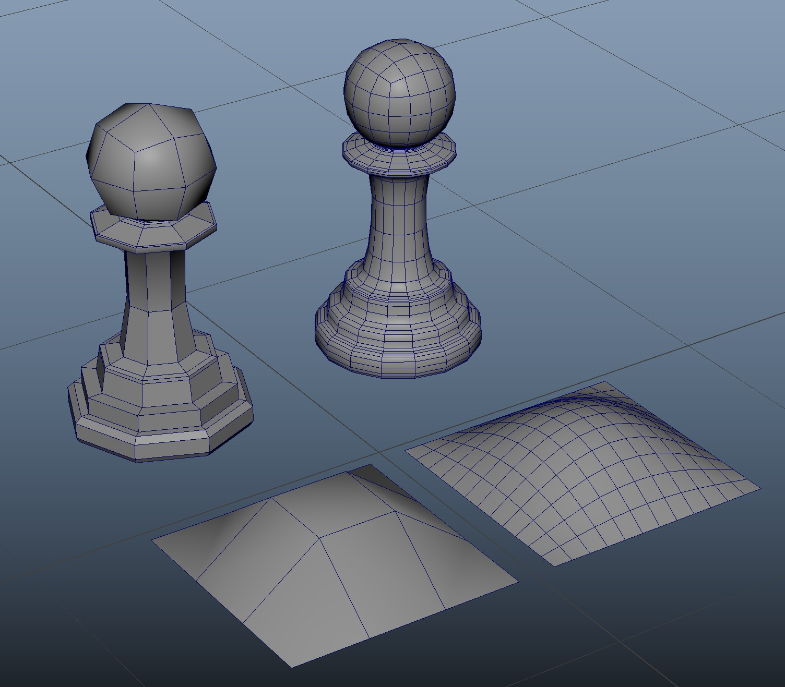
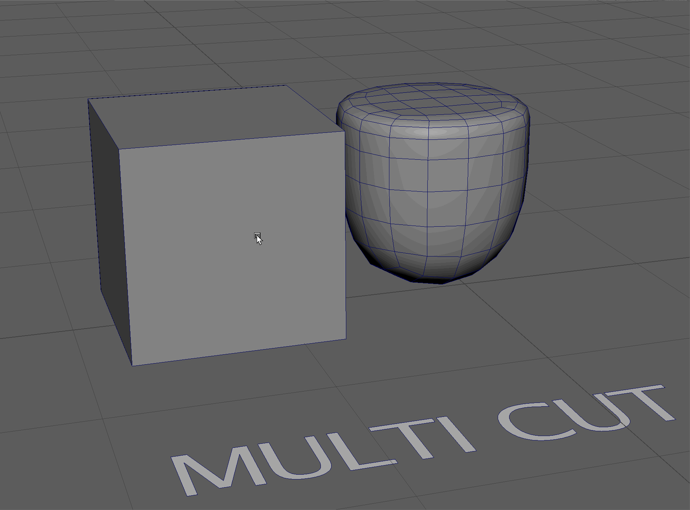
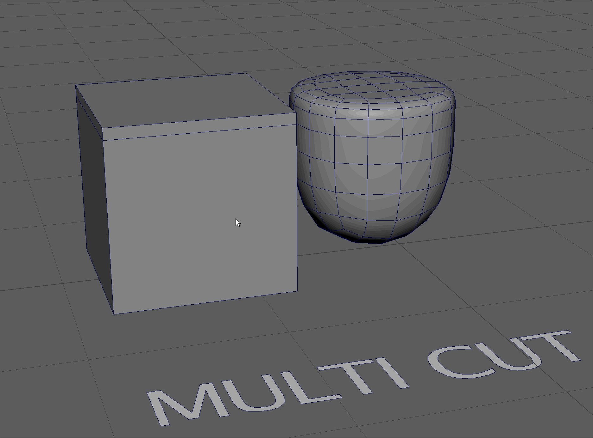
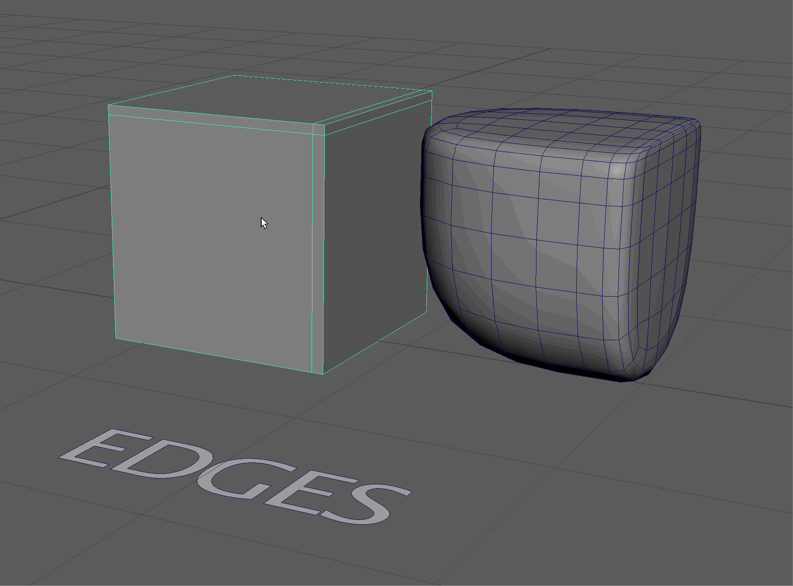
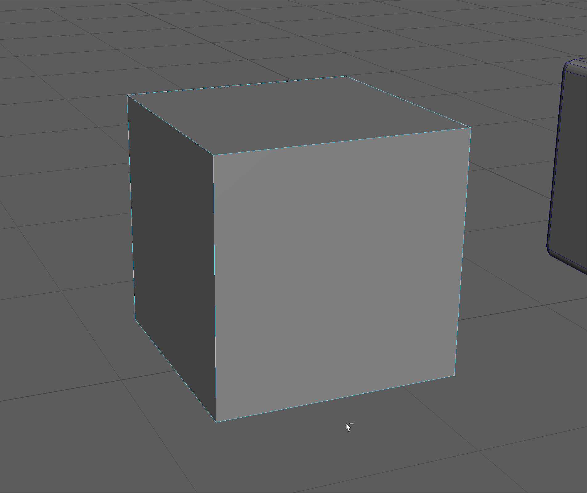
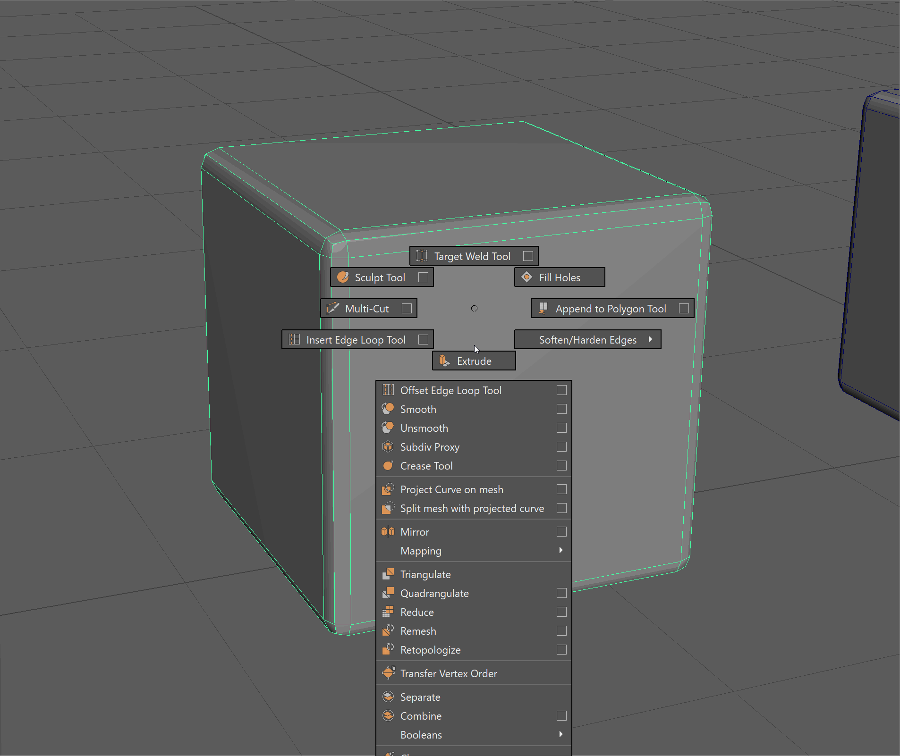
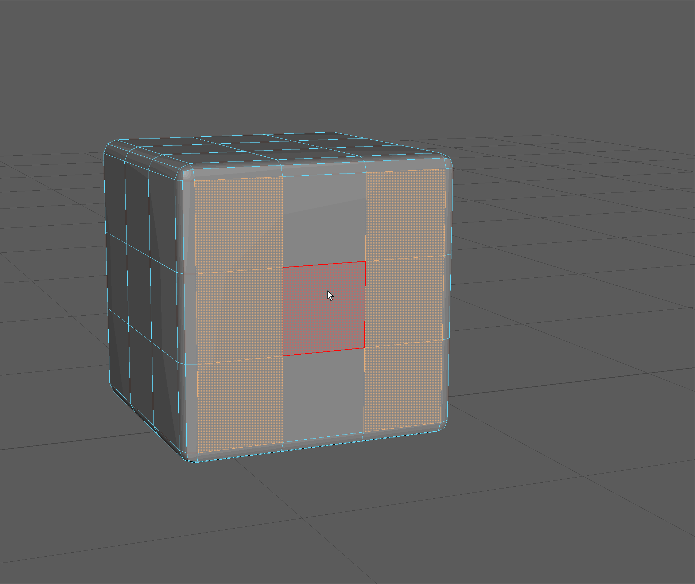
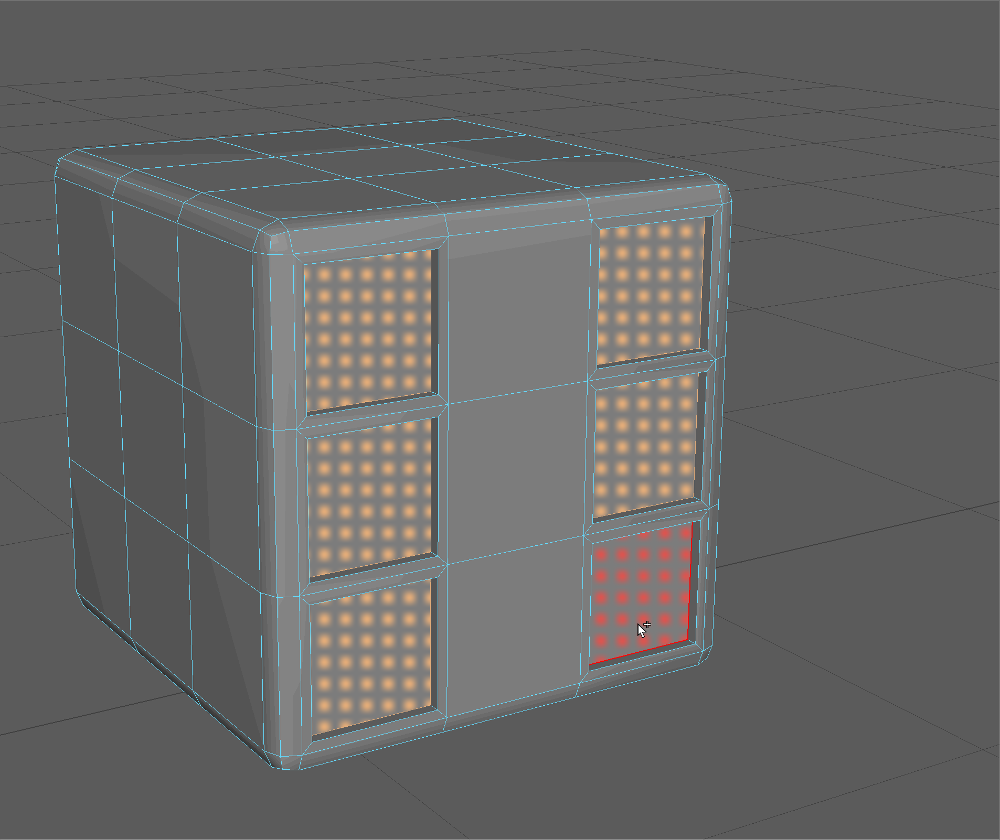

# Subdivision Modeling
> `RECAP:` What we learned last class:

> - Aspects of Polygonal Modeling with Maya
> - Faces
> - Edges
> - Vertices
> - Space and Transforms
> - Arch Exercise
> - Tree Exercise

> `PLAN:`

> - What is subdivision modeling and how to we use it to make more complex models?
> - How to use Edge Loops to change the shape of subdivided models
> - Using subdivision to make a die.
> - History of the Utah Teapot
> - Using subdivision to model the Utah Teapot

## Artist Spotlight

### Char Davies
> Canadian, b. 1954

> [Artist Website](https://wwwimmersence.com)

>[Arist Talk with Char Davies and Jakob Kudsk Steensen](https://www.youtube.com/watch?v=cucworlX8wU&t=1s)

#### *Osmose*

Virtual Reality Installation, 1995

[Website](https://www.immersence.com/osmose) - [Video](https://www.youtube.com/watch?v=54O4VP3tCoY)

##### Images

<figure> <figcaption>Still from Osmose, Char Davies</figcaption></figure>

> LOREM

> Char Davies, immersence.com/osmose

#### *Ephémère*

Virtual Reality Installation, 1998

[Website](https://www.immersence.com/ephemere) - [Video](https://www.youtube.com/watch?v=XCWaMll0leI)

##### Images

<figure> <figcaption>Still from Ephémère, Char Davies</figcaption></figure>

<figure> <figcaption>Still from Ephémère, Char Davies</figcaption></figure>

<figure> <figcaption>Still from Ephémère, Char Davies</figcaption></figure>

<figure> <figcaption>Installation view of Ephémère, Char Davies</figcaption></figure>

## Subdivision Basics

Start by downloading the practice file for today's class.

You'll notice for this class, the practice file is stored in a zip folder.

We'll talk about project structure more in a bit, but, for now, unzip the file on your computer.

Navigate to the scenes folder and open the .mb file.

<figure> <figcaption>Subdivided Models</figcaption></figure>

Subdivision modeling is the process of using lower resolution geometry to create complex objects with clean topology. Subdivision modeling is the most common form of poly modeling, being used in games, animation, visual effects, and art practices.

Subdivision, divides each each loop and averages the positions of the new vertices.

<figure> <figcaption>Edge loops divided and vertices averaged</figcaption></figure>

There are many different algorithms for subdivided a model. Maya by default uses an adapted version of the Catmull–Clark Subdivision algorithm (more on this in the coming weeks). Other algorithms include OpenSubdiv, developed by Pixar.

### Smooth Preview vs. Smooth

We can preview what our mesh will look like subdivided using the **3** Key.

We can return turn off the **Smooth Preview** by pressing the **1** Key.

<figure> <figcaption></figcaption></figure>

The **2** Key will show us our model in smooth preview as well as the **cage** of our original mesh.

You can see the cage as an outline of the edges of your model. This is called the **wireframe**
>`UI TIP:` You can switch between a global wireframe mode by pressing the **4** key. Switch back to **Shaded** mode using the **5** key.

<figure> <figcaption></figcaption></figure>

To actually change the geometry of our model we can navigate holding **Shit+RMB** to Smooth.
This will bring up a dialog box asking us how many divisions we want to make.

<figure> <figcaption></figcaption></figure>

We can subdivide our model as many times as we want. However, over dividing our model, and creating a model with too many faces can cause our Maya scene to run drastically slower and even crash. Subdivision modeling is a balance between getting the right amount of smoothness for our scene, and making sure out computer can still run!

With this in mind, the end result of our model, or how smooth our model should be, depends on its final destination. In an animation, were everything is calculated before hand and we only see the final result, a fairly high poly model is okay.

In games, however, where everything is being calculated in real time, we want our model to be as low resolution as possible while still describing the shape or form that we want to convey.

<figure> <figcaption></figcaption></figure>

We also move our geometry in smooth preview to see the different effects of smoothing.

<figure> <figcaption></figcaption></figure>

### Multi-Cut Tool for Subdivision

We can change the shape of our subdivided model by placing edges loops at specific locations on our model.

Since subdivision divides edge loops and averages the position of vertices, placing edge loops close together will result in less drastic change of position and the appearance of a harder edge.

The easiest way to add edge loops quickly in Maya is by using the **Multi-cut tool**.

To activate the **Multi-cut tool**, in object mode, use the **Shift + RMB** menu and navigate to **Multi-cut**.

The **Multi Cut tool** can be used for a variety of different operations, including adding new edges to our model through cutting.

We will be using it to add edge loops.

Hold **Ctrl** with the Multi-cut tool active and click on your model to add an edge loop.

<figure> <figcaption></figcaption></figure>

We see that when we smooth our model with two levels of subdivision, the top of the model appears to be a harder edge.

<figure> <figcaption></figcaption></figure>

### Effects of Edges on Smoothing

If we use the multi cut on two sides our model, we get a different result.

<figure> <figcaption></figcaption></figure>
<figure> <figcaption></figcaption></figure>

We can also use the Multi-cut tool to add two edge loops on either side of an existing edge loop to create hard edges. This is sometime called **Triple Fencing.**

Let's try fencing in some edges on this model of a pawn to give it some harder edges when subdivided.

<figure> <figcaption></figcaption></figure>

### Deleting Faces for Different Results

Having an open face, by deleting a part of our geometry is a great technique for keeping parts our model undivided as we build out more complex geometry. 

<figure> <figcaption></figcaption></figure>

## Modeling a Die

### Bevel Tool

An easy way to add edges around all parts of our existing edge loops is to use the **Bevel tool.**

The bevel tool will **bevel** or, in other words, soften the edges of our model.

Begin by selecting all the edges of our die.

<figure> <figcaption></figcaption></figure>

Next, use Shift+RMB to navigate to bevel.

Lets set our fraction to .01 and our segments to 2.

<figure> <figcaption></figcaption></figure>

Next, Lets add in edge loops for the number indicators for our die.

Use the insert edge loop tool to add two additional edge loops on all sides of our die.

Make sure to click on the setting box to change the number of edge loops we are inserting.

<figure> <figcaption></figcaption></figure>

Next, let's start by making the 1-Side and 6-Side of our die by selecting the appropriate faces.

The 1-Side and 6-Side are opposite each other.

<figure> <figcaption></figcaption></figure>

We can the indentation for our die to have a hard edge. Lets add one edge loop to be around our extruded area by using the offset tool in our extrude settings.

Make sure **Keep Faces Together** is set to off.

`UI TIP:` Hold **Ctrl+Shift** while dragging on a parameter in a dialog box to make it change values slower.

<figure> <figcaption></figcaption></figure>

Next, let's extrude in slight, to fully fence in the edge loop of our inset area.

<figure> <figcaption></figcaption></figure>

Let's extrude in to make the full inset.

<figure> <figcaption></figcaption></figure>

We'll be using this model for our independent exercise. Let's duplicate it so we have a clean copy before smoothing.

<figure> <figcaption></figcaption></figure>

Finally, lets give our model 2 levels of subdivision and see how it looks!

<figure> <figcaption></figcaption></figure>

## Class Exercise - Dice

Use the below model from **Sketchfab** to see which sides of the die are next to and opposite each other.
Use the steps in the Modeling a Die section to make a die with two levels of subdivision.

Press play to start the model and use **click+drag** to rotate the model.

 <iframe title="Dice d6 low-poly PBR" frameborder="0"  height = "400px" width = "400px" src="https://sketchfab.com/models/7c7c839a76c44f36be942b1c87b040d7/embed"> </iframe> 
 <a href="https://sketchfab.com/3d-models/dice-d6-low-poly-pbr-7c7c839a76c44f36be942b1c87b040d7?utm_medium=embed&utm_campaign=share-popup&utm_content=7c7c839a76c44f36be942b1c87b040d7" target="_blank" rel="nofollow" style="font-weight: bold; color: #1CAAD9;"> Dice d6 low-poly PBR </a> by <a href="https://sketchfab.com/ArmorAndRum?utm_medium=embed&utm_campaign=share-popup&utm_content=7c7c839a76c44f36be942b1c87b040d7" target="_blank" rel="nofollow" style="font-weight: bold; color: #1CAAD9;"> Armor and Rum </a> on <a href="https://sketchfab.com?utm_medium=embed&utm_campaign=share-popup&utm_content=7c7c839a76c44f36be942b1c87b040d7" target="_blank" rel="nofollow" style="font-weight: bold; color: #1CAAD9;">Sketchfab</a>

## Utah Teapot

[Reference](https://graphics.cs.utah.edu/teapot/)

The Utah teapot was developed by Martin Newell at the University of Utah in 1975. For much of computer graphics history, it was the standard model for testing modeling, lighting, texturing and rendering algorithms.

We'll be reading more about the Utah teapot and understanding its cultural and political impact in chapter 3 of Jacob Gaboury's book *Image Objects.*

Although the original teapot was used using an earlier modeling method called Bezier splines, we'll be modeling our teapot using subdivision modeling techniques.

<figure> <figcaption>
Original drawing of the Utah Teapot by Martin Newell <a href= "https://graphics.cs.utah.edu/teapot/">Link</a>
</figcaption></figure>

 Rendering of the Utah Teapot by <a href="//commons.wikimedia.org/wiki/User:Dhatfield" title="User:Dhatfield">Dhatfield</a> - Own work, <a href="https://creativecommons.org/licenses/by-sa/3.0" title="Creative Commons Attribution-Share Alike 3.0">CC BY-SA 3.0</a>, <a href="https://commons.wikimedia.org/w/index.php?curid=4303243">Link</a>

 The Original Teapot used to make the Utah Teapot Model. Photo by Marshall Astor (<a rel="nofollow" class="external free" href="http://www.marshallastor.com/">http://www.marshallastor.com/</a>) - <a rel="nofollow" class="external free" href="https://www.flickr.com/photo_zoom.gne?id=352811902&amp;size=o">https://www.flickr.com/photo_zoom.gne?id=352811902&amp;size=o</a> (<a rel="nofollow" class="external free" href="https://www.flickr.com/photos/lifeontheedge/352811902/">https://www.flickr.com/photos/lifeontheedge/352811902/</a>), <a href="https://creativecommons.org/licenses/by-sa/2.0" title="Creative Commons Attribution-Share Alike 2.0">CC BY-SA 2.0</a>, <a href="https://commons.wikimedia.org/w/index.php?curid=1743696">Link</a>

## Modeling the Utah Teapot

Let's use this [tutorial](./Teapot.md) to learn more about subdivision by modeling the Utah Teapot.

New things will learn in this tutorial:

- Edge sliding
- [Live Objects](https://help.autodesk.com/view/MAYACRE/ENU/?guid=GUID-EBF1E652-4DDD-423F-B42E-3BF85AE46A5D)
- Vertex Sliding
- Hiding and un-hiding objects

## Independent Exercise: Teapot Handle

Use what you learned through the [tutorial](./Teapot.md) to model the handle for the teapot.

As a starting point, the handle should attach using the below Faces. Count how many edges are on the border of the selected faces.

As an extra challenge, try starting with only a plane!

<figure> <figcaption>Faces where the handles should attach</figcaption></figure>
